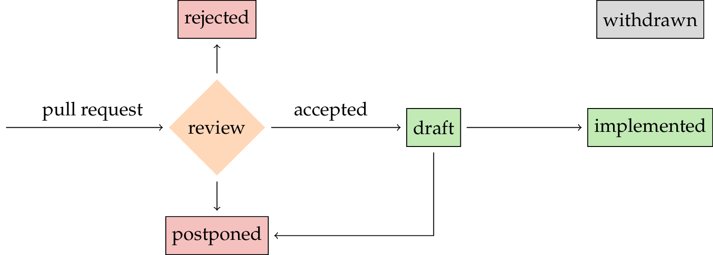

# AEP 000: AiiDA Enhancement Proposal (AEP) Guidelines

| AEP number | 000                                                          |
|------------|--------------------------------------------------------------|
| Title      | AiiDA Enhancement Proposal (AEP) Guidelines                  |
| Authors    | [Kevin M. Jablonka](mailto:kevin.jablonka@epfl.ch) (kjappelbaum), [Leopold Talirz](mailto:leopold.talirz@epfl.ch) (ltalirz)|
| Champions  | [Kevin M. Jablonka](mailto:kevin.jablonka@epfl.ch) (kjappelbaum), [Leopold Talirz](mailto:leopold.talirz@epfl.ch) (ltalirz)|
| Type       | P - Process                                                  |
| Created    | 19-Mar-2019                                                  |
| Status     | implemented                                                  |

## Background 
The AiiDA ecosystem with its plugins is growing beyond the bounds of EPFL
and would benefit from a public discussion of design issues that can bring 
all stakeholders to the table, while also serving as a documentation of the decision process.

See also [PEP-1](https://www.python.org/dev/peps/pep-0001/) for the rationale behind
introducing enhancement proposals for the python project. 

## Proposed Enhancement 
The AEP process will be used to propose and discuss new features and design decisions for the AiiDA project. 
This file itself constitutes an AEP and can be used a template for new AEPs. 

## Detailed Explanation 
An AEP should contain the following elements:

#### Title

Should be short and uniquely identify the proposed enhancement

#### Header table

A table containing:
  * AEP number: numbered consecutively by submission date. The number should be padded 
    with leading zeros to convert the number to a three digiti number.
  * title
  * authors: preferably with GitHub user names
  * champions: individuals willing to take care of implementing the AEP
  * type: one of
    * `S - Standard Track AEP`: describes new features or changes to AiiDA
    * `I - Informational AEP`: describes design issues or best practice. A notable informational PEP is [the Zen of Python](https://www.python.org/dev/peps/pep-0020/)
    * `P - Process AEP`: describes changes to processes in the AiiDA ecoystem, such as a change to the decision making or development process (e.g. new standards for commit messages)
  * date of creation: when the pull request for this AEP was opened
  * status: one of
    * `draft` - this AEP has been accepted for further discussion and development
    * `implemented` - this AEP has been implemented
    * `postponed` - this AEP is no longer active, might be interesting for the project but has noone willing to champion it
    * `rejected` - this AEP has been rejected and will not be implemented
    * `withdrawn` - this AEP has been withdrawn by the submitter but can be re-submitted if someone is willing to champion it

 

#### Background

A description of the problem, e.g. containing a snippet of code that show an issue or bad design.

#### Proposed Enhancement

An abstract (1-2 sentences) of the proposed enhancement, ideally containing (pseudo)code samples describing the solution.

#### Detailed Explanation

A detailed discussion about all relevant technical information, possible API designs and transition plans.

#### Pros and Cons

A summary for pros and cons for the proposed enhancement, detailing e.g. which possible compatibility issues may arise.

### How to submit an AEP

1. [Fork](https://help.github.com/en/articles/fork-a-repo) this repository
2. Create a folder with the title of the AEP in lower [snake-case](https://en.wikipedia.org/wiki/Snake_case)
   and put readme file in [Markdown](https://guides.github.com/features/mastering-markdown/) format inside this folder.
     * You may use this `readme.md` as a template.
     * You may use the folder to include additional files relevant to your enhancement proposal.
     * Add your AEP to the `README.md` and `_toc.yml` files at the root of the repository.
     * Consider discussing your proposal informally with an [AiiDA team](https://github.com/orgs/aiidateam/people) member to get an initial reaction
       and, potentially, another champion for your proposal.
3. Commit your changes and submit a [pull request](https://help.github.com/en/articles/creating-a-pull-request) to the AEP repository
     * Apply appropriate type and status labels to your pull request.

At this point, your pull request will start to be reviewed by members of the [AiiDA team](https://github.com/orgs/aiidateam/people).
If possible, new AEPs should be presented by one of its champions at one of the periodic AiiDA developer meetings (per video conference or in person).

If your AEP is accepted, the status will change to `active` and you can start working on completing its implementation.

## Pros and Cons 

### Pros
* The public discussion of enhancement proposals lets the entire AiiDA community see what developments lie ahead
  and allows those interested to actively participate in shaping them
* AEPs provide basic guidance on how to "make a case" for an enhancement such that it can be seriously discussed
  before investing efforts in its implementation
* The corresponding pull requests provide a public record of the decision process in case questions arise later

### Cons
* Slightly increased overhead compared to an informal email trail or a Google document
