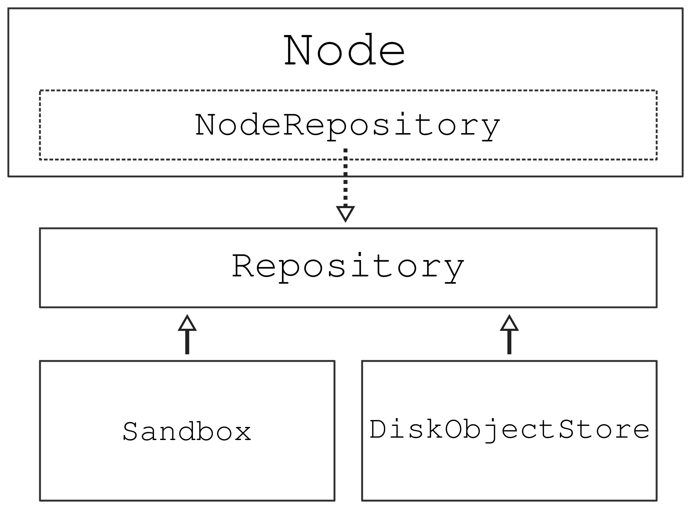

# Abstract and improve the file repository

| AEP number | 007                                                             |
|------------|-----------------------------------------------------------------|
| Title      | Abstract and improve the file repository                        |
| Authors    | [Sebastiaan P. Huber](mailto:sebastiaan.huber@epfl.ch) (sphuber)|
| Champions  | [Sebastiaan P. Huber](mailto:sebastiaan.huber@epfl.ch) (sphuber) [Leopold Talirz](mailto:leopold.talirz@epfl.ch) (ltalirz)|
| Type       | S - Standard                                                    |
| Created    | 18-Oct-2019                                                     |
| Status     | submitted                                                       |

## Background
The persistent state of a node in the provenance graph is stored across two resources.
The relational database and a file repository.

Currently, the implementation of the file repository is not configurable but is hardcoded as a custom solution on the file system that is local to the AiiDA instance.
The custom solution suffers from performance issues when scaled to a large number of nodes that contain many files.
The reason is that each node gets its own folder on the disk, even if it doesn't contain any files, and each file is stored separately in the folder of the corresponding node.
This leads to a large number of inodes being required, which are limited on any file system.

File systems can be reformatted to provide more inodes, however, this is not really an operation we should be requiring users to perform.
In addition, even if the file system has sufficient inodes, the storing of files as individual files has an enormous impact on performance when indexing the disk.
For example, merely counting the number of files for the current repository architecture will be extremely costly for even moderately sized repositories.
This has a direct impact on important operations such as creating a backup.
Even with optimized tools as `rsync` creating a backup can take days for large databases (of the order of 10 million nodes), where a large part is not even due to the data transfer but merely the indexing of the repository to detect the changes.

These scaling performance issues of the file repository pose concrete problems for users with large databases.
The current implementation of the file repository needs to be replaced with a solution that scales with many files and is easy to backup, while keeping writing performance during operation of AiiDA's daemon.
Alternatively, or additionally, it should be possible to configure an alternative repository implementation for a profile.
For this the repository implementation should be abstracted such that it can be implemented for alternative backends that are potentially more suitable for certain use cases.

## Proposed Enhancement
The scaling problem of the original file repository implementation has already been described in great detail in [AEP 006: Efficient object store for the AiiDA repository](https://github.com/aiidateam/AEP/tree/master/006_efficient_object_store_for_repository#readme).
It also describes an efficient key-value store that is implemented in the [`disk-objectstore`](https://github.com/aiidateam/disk-objectstore) library.
This AEP describes how the `disk-objectstore` is integrated into `aiida-core` to replace the original solution for the file repository, solving the scaling problems in performance.

The following requirements were considered during the design of the file repository implementation:

* Scalability: the repository should be able to store millions of files, all the while permitting efficient backups.
* Heterogeneity: the repository should operate efficiently for data that is heterogeneous in size, with object of size ranging from a few bytes to multiple gigabytes.
* Simplicity: the solution should not require an actively running server to operate.
* Concurrency: the repository should support multiple concurrent reading and writing processes.
* Efficiency: the repository should automatically deduplicate file content in an effort to reduce the total amount of required storage space.

The interface to the file repository is also properly abstracted to support any file or object store.
The support of a (virtual) directory hierarchy, as provided by a local file system, is not assumed and therefore not required.
The decoupling and abstraction of the file repository makes it possible, in theory, to implement it in the future for another backend than the `disk-objectstore`.

However, this AEP intentionally does not go into detail how an alternative backend can be configured on a per-profile basis, but will assume that only support for the `disk-objectstore` will be provided for now.
Nevertheless, the file repository is integrated in such a decoupled manner that it will be easy to implement this additional functionality in the future.
Possible use-cases might be to have a file repository on a remote file system, accessed over SSH or even a traditional object store (like [S3](https://aws.amazon.com/s3/) or [SWIFT](https://wiki.openstack.org/wiki/Swift)) that communicate through REST APIs.

## Detailed Explanation

### Abstracting the file repository interface
Currently the integration of the repository is tightly coupled to the implementation of the ORM.
This makes it difficult to provide different implementations.
The first step then would be to abstract the repository concept and write a generic interface to list, create, get and delete objects in it.

The new interface for the file repository is defined through an abstract class, called the `AbstractRepositoryBackend`.
Its interface is shown below.
```python
class AbstractRepositoryBackend(metaclass=abc.ABCMeta):
    """Class that defines the abstract interface for an object repository."""

    @property
    @abc.abstractmethod
    def uuid(self) -> Optional[str]:
        """Return the unique identifier of the repository."""

    @property
    @abc.abstractmethod
    def key_format(self) -> Optional[str]:
        """Return the format for the keys of the repository.

        Important for when migrating between backends (e.g. archive -> main), as if they are not equal then it is
        necessary to re-compute all the `Node.repository_metadata` before importing (otherwise they will not match
        with the repository).
        """

    @abc.abstractmethod
    def initialise(self, **kwargs) -> None:
        """Initialise the repository if it hasn't already been initialised.

        :param kwargs: parameters for the initialisation.
        """

    @property
    @abc.abstractmethod
    def is_initialised(self) -> bool:
        """Return whether the repository has been initialised."""

    @abc.abstractmethod
    def erase(self) -> None:
        """Delete the repository itself and all its contents.

        .. note:: This should not merely delete the contents of the repository but any resources it created. For
            example, if the repository is essentially a folder on disk, the folder itself should also be deleted, not
            just its contents.
        """

    @staticmethod
    def is_readable_byte_stream(handle) -> bool:
        return hasattr(handle, 'read') and hasattr(handle, 'mode') and 'b' in handle.mode

    def put_object_from_filelike(self, handle: BinaryIO) -> str:
        """Store the byte contents of a file in the repository.

        :param handle: filelike object with the byte content to be stored.
        :return: the generated fully qualified identifier for the object within the repository.
        :raises TypeError: if the handle is not a byte stream.
        """

    @abc.abstractmethod
    def _put_object_from_filelike(self, handle: BinaryIO) -> str:
        pass

    def put_object_from_file(self, filepath: Union[str, pathlib.Path]) -> str:
        """Store a new object with contents of the file located at `filepath` on this file system.

        :param filepath: absolute path of file whose contents to copy to the repository.
        :return: the generated fully qualified identifier for the object within the repository.
        :raises TypeError: if the handle is not a byte stream.
        """

    @abc.abstractmethod
    def has_objects(self, keys: List[str]) -> List[bool]:
        """Return whether the repository has an object with the given key.

        :param keys:
            list of fully qualified identifiers for objects within the repository.
        :return:
            list of logicals, in the same order as the keys provided, with value True if the respective
            object exists and False otherwise.
        """

    def has_object(self, key: str) -> bool:
        """Return whether the repository has an object with the given key.

        :param key: fully qualified identifier for the object within the repository.
        :return: True if the object exists, False otherwise.
        """

    @abc.abstractmethod
    def list_objects(self) -> Iterable[str]:
        """Return iterable that yields all available objects by key.

        :return: An iterable for all the available object keys.
        """

    @contextlib.contextmanager
    def open(self, key: str) -> Iterator[BinaryIO]:
        """Open a file handle to an object stored under the given key.

        .. note:: this should only be used to open a handle to read an existing file. To write a new file use the method
            ``put_object_from_filelike`` instead.

        :param key: fully qualified identifier for the object within the repository.
        :return: yield a byte stream object.
        :raise FileNotFoundError: if the file does not exist.
        :raise OSError: if the file could not be opened.
        """

    def get_object_content(self, key: str) -> bytes:
        """Return the content of a object identified by key.

        :param key: fully qualified identifier for the object within the repository.
        :raise FileNotFoundError: if the file does not exist.
        :raise OSError: if the file could not be opened.
        """

    @abc.abstractmethod
    def iter_object_streams(self, keys: List[str]) -> Iterator[Tuple[str, BinaryIO]]:
        """Return an iterator over the (read-only) byte streams of objects identified by key.

        .. note:: handles should only be read within the context of this iterator.

        :param keys: fully qualified identifiers for the objects within the repository.
        :return: an iterator over the object byte streams.
        :raise FileNotFoundError: if the file does not exist.
        :raise OSError: if a file could not be opened.
        """

    def get_object_hash(self, key: str) -> str:
        """Return the SHA-256 hash of an object stored under the given key.

        .. important::
            A SHA-256 hash should always be returned,
            to ensure consistency across different repository implementations.

        :param key: fully qualified identifier for the object within the repository.
        :raise FileNotFoundError: if the file does not exist.
        :raise OSError: if the file could not be opened.
        """

    @abc.abstractmethod
    def delete_objects(self, keys: List[str]) -> None:
        """Delete the objects from the repository.

        :param keys: list of fully qualified identifiers for the objects within the repository.
        :raise FileNotFoundError: if any of the files does not exist.
        :raise OSError: if any of the files could not be deleted.
        """

    def delete_object(self, key: str) -> None:
        """Delete the object from the repository.

        :param key: fully qualified identifier for the object within the repository.
        :raise FileNotFoundError: if the file does not exist.
        :raise OSError: if the file could not be deleted.
        """
```
Since it is envisioned that solutions will be implemented that are not necessarily file system based, it is important that the interface does not implicitly bake-in file-system-only concepts.
Therefore, the abstract repository interface talks exclusively about "objects" in the repository, where an object essentially refers to a byte stream..
The repository is also not forced to support a file hierarchy, i.e., a structure where files can be stored in (nested) directories, but is simply a flat key-value store.

The values in the key-value store are plain byte streams and the key is a string-based identifier that is generated by the implementation when a new object is stored.
The identifier should be persistent and uniquely identify its associated object in the repository.

### Abstract file repository interface implementations
AiiDA ships with two implementations of the `AbstractRepositoryBackend` interface described in the previous section:

 * `SandboxRepositoryBackend`: implements the interface for a temporary directory on the local file system.
 * `DiskObjectStoreRepositoryBackend`: implements the interface for the `disk-objectstore` key-value store.

The `SandboxRepositoryBackend` is used for unstored nodes.
This enables quick and efficient writing of files and when the node is never stored, the files are automatically deleted from the file system when the node goes out of scope.
When a node is stored, the contents of the `SandboxRepositoryBackend` are copied to the `DiskObjectStoreRepositoryBackend`.

Note that the `DiskObjectStoreRepositoryBackend` doesn't have a concept of nodes, nor does it have the concept of file hierarchies, like the node does.
This concept of virtual file hierarchies is managed through the `Repository` class, which sits on top of the file repository backend.
The important parts of the interface of the `Repository` class are sketched below:
```python
class Repository:
    """Interface to the file repository backend that keeps a record of the virtual file hierarchy and key mapping.

    This class provides an interface to a backend file repository instance, but unlike the backend repository, this
    class keeps a reference of the virtual file hierarchy. This means that through this interface, a client can create
    files and directories with a file hierarchy, just as they would on a local file system, except it is completely
    virtual as the files are stored by the backend which can store them in a completely flat structure. This also means
    that the internal virtual hierarchy of a ``Repository`` instance does not necessarily represent all the files that
    are stored by repository backend. The repository exposes a mere subset of all the file objects stored in the
    backend. This is why object deletion is also implemented as a soft delete, by default, where the files are just
    removed from the internal virtual hierarchy, but not in the actual backend. This is because those objects can be
    referenced by other instances.
    """

    def __init__(self, backend: AbstractRepositoryBackend = None):
        """Construct a new instance with empty metadata.

        :param backend: instance of repository backend to use to actually store the file objects. By default, an
            instance of the ``SandboxRepositoryBackend`` will be created.
        """

    @classmethod
    def from_serialized(cls, backend: AbstractRepositoryBackend, serialized: Dict[str, Any]) -> 'Repository':
        """Construct an instance where the metadata is initialized from the serialized content.

        :param backend: instance of repository backend to use to actually store the file objects.
        """
        instance = cls.__new__(cls)
        instance.__init__(backend)

        if serialized:
            for name, obj in serialized['o'].items():
                instance.get_directory().objects[name] = cls._file_cls.from_serialized(obj, name)

        return instance

    def serialize(self) -> Dict[str, Any]:
        """Serialize the metadata into a JSON-serializable format.

        :return: dictionary with the content metadata.
        """
        return self._directory.serialize()

```
A node uses an instance of the `Repository` to write content to the file repository.
The methods for object creation and retrieval of the `Repository` class (which are not explicitly shown in the design above) match that of the interface of the repository backend.
This allows the `Repository` to simply call through to the same method.
The one difference between the interfaces is that the methods of the `Repository` operate on relative file paths (which represent the location of file in the virtual file hierarchy) whereas the `AbstractRepositoryBackend` works with unique identifiers.
The `Repository` keeps a mapping of the objects in its virtual hierarchy to the unique identifier under which they are stored in the backend.

The constructor of the `Repository` initializes a new instance with an empty file hierarchy.
However, the `from_serialized` classmethod allows to instantiate it from a serialized file hierarchy.
This serialization is generated by the `serialize` method.
These two methods provide a closed loop: a constructed `Repository` instance, which is used to store files through, can be reconstructed identically using `from_serialized`, passing in the serialized version of the hierarchy returned by the `serialize` method.
```python
backend = SandboxRepositoryBackend()
repository = Repository(backend=backend)
# Perform some object creation operations
serialized = repository.serialize()
reconstructed = Repository.from_serialized(serialized)
assert reconstructed.serialize() == serialized
```

### Index of node repository contents in database
Although the `Repository` class is capable of keeping track of the virtual hierarchy of objects stored and the mapping of the keys with which they are stored in the backend, this information is stored in memory and therefore would be lost once the interpreter exits.
To persist the data, the serialized virtual hierarchy of a node is stored in the relational database.
The node table is extended with the column `repository_metadata` that is a JSON field.

When a node is stored, the contents of the sandbox repository is copied to the main file repository.
The virtual hierarchy is then serialized and stored in the `repository_metadata` field of the table row.
When a node is loaded, the repository is initialized from the serialized hierarchy stored in that field.

The serialized virtual hierarchy has the following structure:
```python
{
    'o': {
        'empty': {},
        'file.txt': {
            'k': 'abcdef',
        }
    }
}
```
Each key can either represent a directory or a file, where the key itself represents the relative name of the directory or file in the hierarchy.
If a key is a directory, its value is another dictionary that contain other directories or files.
If a key is a file, the value is a dictionary that contains the key `k` that represents the unique identifier with which it is stored in the file repository backend.

The format was chosen to allow storing of additional metadata in the future, such as encoding, permissions etc.
It also tries to minimize the size of the serialized hierarchy since it is stored in the relational database, and unnecessary bloating of it can reduce the efficiency of queries and retrieving of data.

### Integration of file repository in the ORM front-end
To expose the functionality of storing files in the file repository for a given node to the end-user through the `Node` interface, it composes the `NodeRepositoryMixin` class.
This mixin initializes the `Repository` class for any given node, based on the contents of its `repository_metadata` field.
It also exposes those methods from the `Repository` class after having performed a mutability check.
If a node is stored, it is immutable, which includes its file repository.
If a user attempts to create a new object or delete an existing one for a stored node, a `ModificationNotAllowed` exception is thrown.

The entire class UML can be represented schematically as follows:


### Migration of existing file repositories
The implementation of the new file repository backend needs to come with a data migration.
The content of the existing file repository needs to be copied to the disk object store and the corresponding virtual file hierarchies need to be serialized and stored in the `repository_metadata` fields of the corresponding nodes.


## Pros and Cons

### Pros
* Abstracting the repository interface allows for having more options that gives more freedom to users.
  High-throughput projects may require a remote file system or object store solution to be able to support the quantities of data that are produced.
* The `disk-objectstore` has been designed especially for AiiDA's use case and is optimized to scale for a large number of files, making bulk retrieval operations very efficient.
  With this new implementation, it now also becomes feasible to regularly update the file repository through standard tools, such as `rsync`.
* The node repository index stored in the database makes it faster to determine what objects are contained in its repository since it is no longer necessary to access the file repository.
* The node repository index allows to provide a uniform set of repository object metadata across repository implementations.

### Cons
* Storing an index of all objects in a node's repository has a non-negligible overhead in database load as well as storage space.
* The storage of files in the repository becomes even more opaque for the user then it already was.
  In the case of an object store this is necessary and not even a downside, but for users only using a local file system, this may be unintuitive.
  However, even in the current situation the user is not supposed to directly access or interact with the repository on the local file system.
