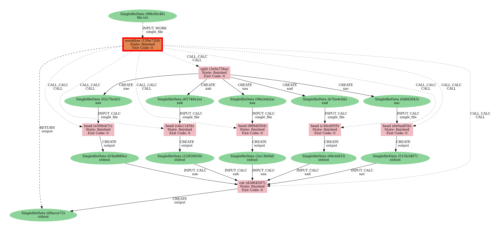

# Infrastructure to easily run shell commands through AiiDA

| AEP number | 009                                                          |
|------------|--------------------------------------------------------------|
| Title      | Infrastructure to easily run shell commands through AiiDA    |
| Authors    | [Sebastiaan P. Huber](mailto:mail@sphuber.net) (sphuber)     |
| Champions  |                                                              |
| Type       | S - Standard Track AEP                                       |
| Created    | 15-Dec-2021                                                  |
| Status     | submitted                                                    |

## Background
Computational workflows take all sorts of forms and can consist of steps that are wildly varying in nature, from running optimized compiled codes on (remote) high-performance computing platforms, to running simple shell commands.
The former are considered first-class citizens in AiiDA and are therefore well supported and easy to use.
However, the execution of simple shell commands on the local machine are notoriously complicated to be run through AiiDA.

Due to the focus that AiiDA puts on provenance, its workflow system requires to extensively declare the interface of the command to be run and to wrap inputs and outputs in Python objects that are representable as nodes in the provenance graph.
These requirements force the user to write a lot of boilerplate code just to be able to run a simple shell command.

In other workflow systems, invoking shell commands take center stage and are often the most important use case.
Combined with a smaller focus on provenance, the resulting interface for running shell commands is typically a lot simpler and more dynamic compared to AiiDA.
Typically, the user can even specify the execution through simple markup files.
An example of such a definition may look like the following:
```yaml
rule diff:
    input:
        a: "file_a.txt"
        b: "file_b.txt"
    output:
        "output.txt"
    shell:
        "diff {input.a} {input.b} > {output}"
```

Trying to replicate this in AiiDA currently is a lot more complex.
The [`aiida-diff` plugin](https://github.com/aiidateam/aiida-diff) actually does this using a `CalcJob`, and the size of the package shows the complexity that is required.
Granted, this plugin package serves as an example and so is somewhat artificially complex, but the point stands.
Running a shell command through AiiDA is not trivial.
Given the fact that running shell commands are standard operations for many computational workflows, AiiDA is currently not a viable option as a workflow system for a great many use cases.

## Functionality requirements

This AEP proposes to add functionality to AiiDA's engine API that make it easy for users to run arbitrary shell commands, while maintaining provenance.
The design of the new functionality should satisfy the following requirements:

* It should be possible to run any shell command that is available on the machine where AiiDA runs.
* The user should be able to run a shell command from an interactive shell or Jupyter notebook in a dynamic manner.
  That is to say that it should not be required to register entry points, define modules that are added to the Python path, or restart the daemon.
* The user should be able to define the command line arguments to be passed to the command.
* The shell command should be able to be run from within an AiiDA workflow (either within a `WorkChain` or a `workfunction`) and so should be able to be run by a daemon worker.
* The provenance of the shell command execution should be kept as if it were a `calcfunction`.
  That is to say that the execution should be represented by a calculation node in the provenance graph.
  The command line arguments should be attached as inputs nodes, and any generated output should be attached as output nodes.
  The solution should strive to make the input and output node specification as granular as possible, i.e., input arguments that specify files should ideally be stored as individual `SinglefileData` nodes.
  Directories should be represented by `FolderData` nodes.

The following requirements are explicitly not required to be supported by the new functionality:

* The invoked shell command should only be runnable in the local interpreter (i.e. on the same machine as where the AiiDA instance is running) and does not have to be able to be run on a remote computer.


## Proposed solution

This AEP proposes to introduce a new decorator `shellfunction`.
This `shellfunction` operates similar to a `calcfunction` as in it can decorate a Python function, which when executed, will be represented by a process node in the provenance graph.
The main difference between the `shellfunction` and the `calcfunction` is that the latter requires an actual implementation of the function, because that defines the data mutation that is performed.
The `shellfunction`, however, doesn't necessarily have to define any data mutation, because that is provided by the shell command that it wraps.
The minimum requirement is simply that the `shellfunction` specified exactly what shell command should be invoked.


## User interface and examples


### Command specification

As an example, let's see how we can execute the `date` command, which prints the current date in string form:
```python
@shellfunction(command='date')
def date():
    pass
```
The name of the Python function can be anything, but it is recommended to use the same name as the shell command that it is to execute.
This is useful because the executed function will be recorded with the database with this label, making it easy to recognize.
Finally, the function does not actually need any implementation: adding the `pass` keyword is sufficient, but you can also add a docstring instead if you prefer to give some more information on what the shellfunction is supposed to be used for.

Note, the `command` argument passed to the `shellfunction` decorator can either be an absolute path or a relative one, as in the example above.
AiiDA will use `shutil.which` from the standard library to try and determine the absolute path of the command if it is relative, and verify that the command exists on the system.

We can invoke the command by simply running the function as you would any other Python function:
```python
results = date()
```
Note that the `results` will be an empty dictionary since the `date` function doesn't return anything.
Nor will the function print anything, because AiiDA will automatically capture the output that the command wrote to the `stdout` and `stderr` file descriptors to the file repository of the process node.

### Captured output
The captured `stdout` and `stderr` content can be retrieved from the process node that represents the `shellfunction`'s execution in the provenance graph.
This can be obtained by calling the `run_get_node` method of the `shellfunction` instead of calling it directly:
```python
results, node = date.run_get_node()
print(node.stdout)
print(node.stderr)
```
This will now return the node in addition to the results.
Through the `node` you can retrieve the captured `stdout` and `stderr` through the corresponding properties.

### Capturing output
Sometimes, the output written to stdout by the shell command is the most important output and so it might be useful to attach it as an actual output node; this way it will be explicitly visible in the provenance graph.
To do so, simply set `attach_stdout=True` in the `shellfunction` decorator.
```python
@shellfunction(command='date', attach_stdout='stdout')
def date():
    """Run the ``date`` command."""
```
The value of the argument `output_filename` should be the filename with which the stdout output is written to the `SinglefileData`.
If we now run the function, we will notice that the `results` are no longer empty:
```python
In [1]: results = date()

In [2]: results
Out[2]: {'stdout': <SinglefileData: uuid: f18624f0-2c3f-4a98-8b82-dd2bf8c99b32 (pk: 1180)>}
```
As we can see, the results now contain a `SinglefileData` node that is attached as an output node with the link label `stdout`.
Printing its output should show us the output written by the `date` command to stdout:
```python
In [1]: results = date()

In [2]: results['stdout'].get_content()
Out[2]: 'Thu 16 Dec 2021 09:53:42 CET\n'
```
Note that regardless of the value of `attach_stdout`, the output written to `stdout` can always be retrieved through the `stdout` property of the process node.

### Command line arguments

#### Flags and options
Often, shell commands can take command line arguments; either through flags, keyword, or positional arguments
For example, the `date` command specifies the `--iso-8601` flag which will print the date (without the time or timezone) in ISO 8601 format.
Arguments like this can be passed to the command through the `arguments` keyword argument when the shellfunction is invoked:
```python
In [1]: from aiida.orm import List

In [2]: @shellfunction(command='date', attach_stdout=True)
   ...: def date():
   ...:     """Run the ``date`` command with optional arguments."""
   ...:

In [3]: arguments = List(['--iso-8601'])

In [4]: results = date(arguments=arguments)

In [5]: results['output'].get_content()
Out[5]: '2021-12-16\n'
```
There are a few things to note here:

 * The arguments should be passed as a `List` node, which can be imported from the `aiida.orm` module.
   This allows the arguments to be attached as an input node to the shellfunction in the provenance graph.
 * Each argument should be specified as a single string.

For example if we want to specify both the `--utc` flag and the `+%y` argument to request the year of the current date in UTC, we would specify the arguments as follows:
```python
In [3]: arguments = List(['--utc', '+%y'])

In [4]: results = date(arguments=arguments)

In [5]: results['output'].get_content()
Out[5]: '2021\n'
```

#### Files
Besides simple flags, shell commands often operate on files.
Single files are typically stored in AiiDA as `SinglefileData` nodes, such that they can be represented in the provenance graph.
It is possible to take existing `SinglefileData` nodes from the database and use them in a `shellfunction` execution.
Let's take as an example the `cat` shell command, that allows to concatenate multiple files into a single one.
The following example shows how you can use this command to concatenate the content of two existing `SinglefileData` nodes into one:
```python
In [1]: import io
   ...: from aiida.engine import shellfunction
   ...: from aiida.orm import SinglefileData

In [2]: @shellfunction(command='cat', attach_stdout=True)
   ...: def cat():
   ...:     """Run the ``cat`` command."""

In [3]: node_a = SinglefileData(io.StringIO('content_a'))
   ...: node_b = SinglefileData(io.StringIO('content_b'))
   ...: arguments = List(['{file_a}', '{file_b}'])

In [4]: cat(arguments=arguments, file_a=node_a, file_b=node_b)
Out[4]: {'output': <SinglefileData: uuid: f15335b0-13be-41e8-be11-d6a0bee55acd (pk: 1194)>}
```
For the purpose of the example, we create two new `SinglefileData` nodes, `file_a` and `file_b`, from a simple string.
However, you can just as well nodes that already exist in the database.
To concatenate two files with the `cat` command, you simply need to specify them as positional arguments, e.g., `cat file_a.txt file_b.txt`.
To communicate to the shellfunction which files should be placed where, the `arguments` specifies the positional arguments by using string placeholders.
These are strings that contain an identifier between curly brackets, e.g., `{file_a}` as in the example and are [standard to Python](https://docs.python.org/3/library/string.html#format-examples).
When the command is invoked, AiiDA will replace this placeholder with the file that is passed under the keyword arguments of the function call.
So in this case, the `cat` shellfunction is called with the `node_a` node assigned to the `file_a` keyword.
This will cause the `{file_a}` argument to be replaced with the content of the `node_a` node.

Since the placeholder needs to correspond to the keyword of the function call, which is used as the link label, the placeholder needs to be a valid link label.
A valid link label consists of alphanumeric characters and underscores, without consecutive underscores.
Besides that, there are no other restrictions on its format.

Positional and keyword arguments can be mixed without a problem.
Consider the following example where we call the `head` command to get the first line of a file:
```python
In [1]: import io
   ...: from aiida.engine import shellfunction
   ...: from aiida.orm import SinglefileData

In [2]: @shellfunction(command='head', output_filename='stdout')
   ...: def head():
   ...:     """Run the ``head`` command."""

In [3]: single_file = SinglefileData(io.StringIO('line 1\nline 2'))
   ...: arguments = List(['-n', '1', '{single_file}'])

In [4]: results = head(arguments=arguments, single_file=single_file)

In [5]: results['output'].get_content()
Out[5]: 'line 1\n'
```

#### Multiple output files
The previous section described how the output written to stdout by the command is captured.
However, certain commands can produce more output besides what is written to stdout.
Take for example the `split` command, which takes a file and splits it into multiple files.
By default, it will write the output files with filenames that follow the sequence `xaa`, `xab`, `xac`, etc.
When this is wrapped with a `shellfunction` one would like to attach each generated output file as an individual `SinglefileData` output node.

The following example shows how multiple output files can be attached as `SinglefileData` output nodes:
```python
In [1]: import io
   ...: from aiida.engine import shellfunction
   ...: from aiida.orm import SinglefileData

In [2]: @shellfunction(command='split', output_filenames['x*'])
   ...: def split():
   ...:     """Run the ``split`` command."""
   ...:

In [3]: single_file = SinglefileData(io.StringIO('line 1\nline 2\line 3'))
   ...: arguments = List(['-l', '1', '{single_file}'])

In [4]: split(arguments=arguments, single_file=single_file)
Out[4]:
{'xab': <SinglefileData: uuid: 1788fa7e-8ed8-4207-a873-147d7e8d4821 (pk: 1218)>,
 'xaa': <SinglefileData: uuid: e1481db5-09c1-4b49-b8c5-5127ed40c108 (pk: 1219)>}
```
The `output_filenames` argument of the `shellfunction` decorator takes a list of strings which represent the output files that should be wrapped and attached as outputs.
If the exact name that will be produced is not known, one can use the wildcard operator `*` which will be expanded by globbing.
The filenames will be used as the link label of the attached output node, where illegal characters are automatically replaced by underscores.

### Workflow demonstration

As the final demonstration for this AEP, let's see how multiple `shellfunction`s can easily be integrated into a workflow using a `workfunction`.
In the following example, we will define a `workfunction` that calls three different `shellfunctions` in succession.

1. A starting input file is split into files of two lines using `split`;
2. The resulting files have the last line removed using `head`;
3. Finally, the single-line files are concatenated to produce a single output file.

The code could look as follows:
```python
from io import StringIO
from pathlib import Path

from aiida.orm import List, SinglefileData
from aiida.engine.processes.functions import shellfunction, workfunction


@shellfunction(command='split', output_filenames=['x*'])
def split():
    """Run the ``split`` command."""


@shellfunction(command='head', attach_stdout=True)
def head():
    """Run the ``head`` command."""


@shellfunction(command='cat', attach_stdout=True)
def cat():
    """Run the ``cat`` command."""


@workfunction
def workflow(single_file):
    """Simple workflow that takes a file, splits it, removes the last line of each and reconcatenates."""

    # Split the file into five files of two lines each.
    arguments = List(['-l', '2', '{single_file}'])
    file_split = split(arguments=arguments, single_file=single_file)

    # Remove the last line of each of the five files.
    arguments = List(['-n', '1', '{single_file}'])
    files_truncated = {key: head(arguments=arguments, single_file=single_file) for key, single_file in file_split}

    # Concatenate the five files into a single file.
    files_concatenated = cat(arguments=List([f'{{{key}}}' for key in files_truncated.keys()]), **files_truncated)

    return files_concatenated


# Create input file with the numbers 0 through 9, one number per line.
single_file = SinglefileData(StringIO('\n'.join([str(i) for i in range(10)])))
workflow(single_file)
```
When we call the `workflow` function with the initial input file, the workflow is run and a `WorkFunctionNode` is produced in the provenance graph.
It accurately records its sole input and the produced output file.
In addition, the calls to the `shellfunction`s are also explicitly represented with `CALL` links, as shown in the graphic representation below.



## Design choices

This section details the design choice for various parts of the functionality and interface.
Where applicable, it provides other solutions that were considered and why they were rejected.

### Function signature
The function decorated by the `shellfunction` decorator should at the very least support the `**kwargs` parameters.
This is because it should allow the `arguments` input node and any `SinglefileData` input nodes to be passed when invoked, even though the function body most likely won't have to operate on them as everything is taken care of by the engine.
Even though it is not that much of a burden for the user to always add `**kwargs` to the function signature, since it practically should always be added, it may as well be added automatically.
That is why the `shellfunction` decorator will inspect the decorated function signature and automatically add the `**kwargs` parameter if not already specified.

### Recording output
When talking about output that is generated by shell commands, it can typically be divided into the following three categories:

 * Output written to the `stdout` file descriptor
 * Output written to the `stderr` file descriptor
 * Output written to a file on disk

#### `stdout` and `stderr`
Since the `stdout` and `stderr` file descriptors are standard and a lot of shell commands are expected to write to them, it makes sense to automatically capture them.
The content should be easily accessible, but should not necessarily have to be recorded as an output node.
That is why in the implementation, by default, they are written to the file repository of the process node with the names `stdout` and `stderr`.
The `ShellFunctionNode` class provides the `stdout` and `stderr` properties as an easy way to retrieve the content from the node.

Having the `stderr` available as a file of the process node is all that is needed, however there is an asymmetry with `stdout`.
The output written to `stdout` by a shell command is often the "main" output and in workflows it is often piped as input to the next command.
In the context of AiiDA, this means it should rather be recorded as an actual output node of the process by wrapping it in a `SinglefileData` node.
If the `stdout` should be returned as an individual output node, the `shellfunction` should define `attach_stdout = True`.
In this case, the `stdout` will not also be written to the process node's repository, as that would be doubling the information.
The `stdout` property will account for this implementation detail, and will retrieve the content from one of these two options, such that the user does not need to know.

#### Output files
Besides `stdout` and `stderr`, a shell command can typically also write output to various files on the local file system.
The user needs to be able to specify to the `shellfunction` which output files should be automatically captured and attached as outputs through `SinglefileData` nodes.
Since there can be any number of output files, it should at the very least accept a list of filenames.
It is not always possible to declare exactly what files will be generated, so the `shellfunction` should support the use of the wildcard character `*`.

The declared output files will be wrapped in `SinglefileData` nodes which will be returned as outputs of the process and so they require a link label.
The most logical solution is to take the filename, however, this is not always possible, because valid filenames are not necessary valid link labels.
The validation rules on link labels are very strict and only alphanumeric characters and underscores are allowed.
In addition, it is not possible to use multiple consecutive underscores, which is reserved by AiiDA to indicate namespaces.
This means that typical filenames, which contain a `.` before the file extension, are not valid link labels.

Automatic substitution of illegal characters by underscores is not really a viable solution.
Take for example the filename `output_.txt`, which would be automatically converted to `output__txt`, which would also be illegal.
One could opt to replace with an arbitrary alphanumeric character, but this would result in unpredictable and weird link labels.
Probably the best solution is to allow users to explicitly define the desired link label in this case.
This requires `output_filenames` to allow tuples instead of strings as its list element, where the tuple consists of the expected output filename and the link label that is to be used.
This approach only really works though for explicit output filenames without wildcards, because for globbed filepaths the same problem as before applies.

### Process node
The `shellfunction`, when executed, is represented by an instance of the `ShellFunctionNode` class.
This is a subclass of the `CalculationNode` class, just as the `CalcFunctionNode` which is the representation of `calcfunction` executions, since it creates new data nodes.
The choice to create a new subclass, instead of repurposing the `CalcFunctionNode`, was made not only for consistency and clarity, but also since this makes it possible to easily distinguish `shellfunction` executions from `calcfuntion` executions in the provenance graph.
By having a separate ORM class, it is also easy to query directly for `ShellFunctionNode` instances.

AiiDA's provenance grammar rules are not complicated by this addition because they only apply to the `CalculationNode` level.
Since the `ShellFunctionNode` class is a subclass of this, all the rules are properly defined and the grammar does not need to be modified.


### Open Questions

This section records open questions on the design and behavior of the new functionality.
Once the questions have been answered in the process of the AEP evaluation, answers are added and serve to record the discussion surrounding the design choices.