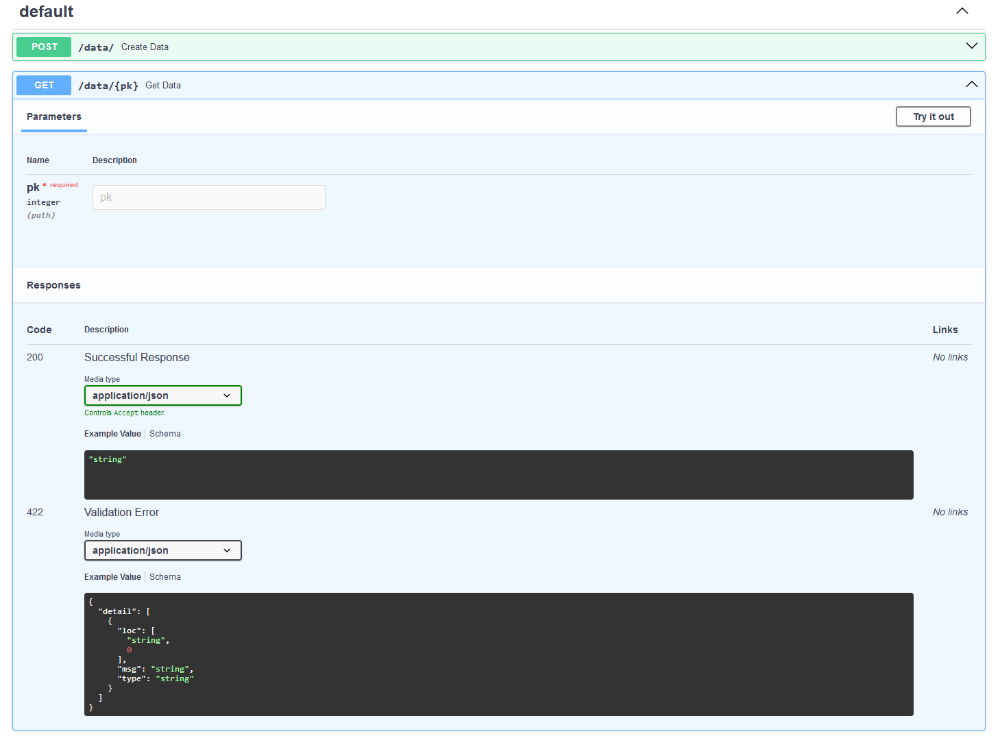

# AEP 010: Add a schema to ORM classes

| AEP number | 010                                                             |
|------------|-----------------------------------------------------------------|
| Title      | Add a schema to ORM classes                                     |
| Authors    | [Sebastiaan P. Huber](mailto:mail@sphuber.net) (sphuber)        |
| Champions  | [Sebastiaan P. Huber](mailto:mail@sphuber.net) (sphuber)        |
| Type       | S - Standard                                                    |
| Created    | 16-Jan-2024                                                     |
| Status     | submitted                                                       |

## Table of contents

* [Background](#background)
* [Design goals](#design-goals)
* [User interface](#user-interface)
* [Example use cases](#example-use-cases)
* [Implementation](#implementation)
* [Design discussion](#design-discussion)
    * [Advantages](#advantages)
    * [Disadvantages](#disadvantages)
    * [Alternatives](#alternatives)

## Background

AiiDA's Python API provides an object relational mapper (ORM) that abstracts the various entities that can be stored inside the provenance graph and the relationships between them.
In most use cases, users use this ORM directly in Python to construct new instances of entities and retrieve existing ones, in order to get access to their data and manipulate it.
A current shortcoming of the ORM is that it is not possible to programmatically introspect the schema of each entity: that is to say, what data each entity stores.
This makes it difficult for external applications to provide interfaces to create and or retrieve entity instances.
It also makes it difficult to take the data outside of the Python environment since the data would have to be serialized.
However, without a well-defined schema, doing this without an ad-hoc solution is practically impossible.

Clear data schemas for all ORM entities would enable the creation of external applications to work with the data stored in AiiDA's provenance graph.
A typical example use case would be a web API whose interface, to create and return ORM entities from an AiiDA profile, would be dynamically generated by programmatically introspecting the schema of all ORM entities stored within it.
Currently, the interface has to be manually generated for each ORM entity, and data (de)serialization has to be implemented.

## Design goals

The goal of this AEP is to provide a mechanism that allows an external application to programmatically determine the schema of all entities of AiiDA's ORM and automatically (de)serialize entity instances to and from other data formats, e.g., JSON.
The new functionality should or may satisfy the following requirements, in order of importance:

* **Functionality**: ORM entities should define a schema of the data that they store. The schema should be introspectable programmatically and the interface should provide methods to (de)serialize instances from and to JSON.
* **Compatibility**: The existing functionality of the ORM should not be affected and all changes should be fully backwards compatible. The ORM is such a fundamental part of AiiDA's API that backwards incompatible changes are inacceptable.
* **Interface**: The interface should be intuitive and easy to use. The primary users are expected to be automated tools as users in interactive mode will probably continue using the existing Python API to create entity instances and retrieve their data.
* **Implementation**: The implementation should be such that the added functionality is either automatically inherited by ORM entity classes that can be customized in external packages, such as `Data` plugins, or the interface is simple enough for the plugins to modify and/or extend the schema.
* **Performance**: The performance of importing the ORM and existing functionality of the ORM should not be significantly impacted in a negative way.

## User interface

The user interface was designed with the following criteria in mind:

* For each ORM entity it should be easy to get and inspect its schema programmatically
* It should be easy to construct an instance of an ORM entity from data serialized according to the schema
* It should be easy to serialize and ORM entity instance to a JSON-compatible format
* It should be easy for a `Data` plugin to extend/customize the schema

The proposed implementation uses [`pydantic`](https://docs.pydantic.dev/latest/) to define the schema of ORM entities.
Each ORM entity class should define the `Model` class attribute, which is a subclass of `pydantic.BaseModel`.
As an example, let's take the base class `Entity`, which only defines a single property, the primary key `pk`.

The model can be retrieved through `Entity.Model`, which in turn allows to use `pydantic`'s rich API to, for example, the model's fields:
```python
In [1]: from aiida.orm import Entity

In [2]: Entity.Model.model_fields
Out[2]: {
    'pk': FieldInfo(
        annotation=Union[int, NoneType],
        required=False,
        description='The primary key of the entity. Can be `None` if the entity is not yet stored.',
        metadata=[{'priority': 0}, {'exclude_to_orm': True}]
    )
}
```
It is also trivial to retrieve the schema in JSON format, which is ideal for web-based APIs:
```python
In [3]: Entity.Model.model_json_schema()
Out[3]:
{
    'properties': {
        'pk': {
            'anyOf': [{'type': 'integer'}, {'type': 'null'}],
            'default': None,
            'description': 'The primary key of the entity. Can be `None` if the entity is not yet stored.',
            'title': 'Pk'
        }
    },
    'title': 'Model',
    'type': 'object'
}
```
An instance of an ORM entity can also easily be serialized to a JSON-compatible format through the `Entity.serialize()` method.
The `Entity.from_serialized` class method allows to reconstruct the instance from serialized data:
```python
In [4]: from aiida.orm import Int

In [5]: node = Int(1)

In [6]: serialized = node.serialize()

In [7]: serialized
Out[7]:
{'pk': None,
 'uuid': '3f5b0b81-3e11-4cd2-976a-2c5d0c62d7ec',
 'node_type': 'data.int.Int.',
 'process_type': None,
 'repository_metadata': {},
 'ctime': datetime.datetime(2024, 1, 18, 16, 9, 43, 388011, tzinfo=datetime.timezone(datetime.timedelta(seconds=3600), 'CET')),
 'mtime': None,
 'label': '',
 'description': '',
 'extras': {},
 'computer': None,
 'user': 1,
 'source': None,
 'value': 1}

In [8]: Int.from_serialized(**serialized)
Out[8]: <Int: uuid: c81da08d-f084-4990-b9a7-f6ccd2c6bb88 (unstored) value: 1>
```
Data plugins can easily extend the model of their base class, simply by adding a `Model` class attribute themselves and adding additional attributes:
```python
from aiida.orm import Data

class PluginData(Data):

    class Model(Data.Model):
        additional_attribute: str
```
As long as the plugin's `Model` class attribute subclasses the `Model` classes of all bases of the plugin's base classes, all model attributes are automatically inherited and any custom attributes can be simply added.

## Example use cases

A typical use case for the new functionality is a REST API that exposes an AiiDA profile, allowing new entities to be created and fetched from the database.
The following example how, using [FastAPI](https://fastapi.tiangolo.com/), it is possible to create a REST API that allows to create an endpoint to create `Data` nodes and query for them by their pk with just a few lines of codes:
```python
from fastapi import FastAPI
from aiida import load_profile, orm

load_profile()
app = FastAPI()

@app.post('/data/')
async def create_data(model: orm.Data.Model):
    data = orm.Data.from_model(model).store()
    return data.to_model()


@app.get('/data/{pk}')
async def get_data(pk: int):
    data = orm.QueryBuilder().append(orm.Data, filters={'id': pk}).one()[0]
    return data.to_model()
```
The FastAPI library is built itself on top of `pydantic` and therefore integrates neatly with the models defined by AiiDA's ORM entities.
The serialization and deserialization of ORM instances is now automatically provided through the `from_model` and `to_model` methods.
Since the schema of the entity model is defined by `pydantic`'s `BaseModel`, FastAPI can automatically generate complete documentation for the interface, as shown in the following screenshot:


The following example demonstrates, using `curl`, how a new node can be created:
```
$ curl -X POST 'http://127.0.0.1:8000/data/' -d '{"label": "some-label", "user": 1}' -H 'Content-Type: application/json'
{
    "pk": 1,
    "uuid":"655ca12b-95a7-4a20-967f-8d634958637b",
    "node_type":"data.Data.",
    "process_type":null,
    "repository_metadata":{},
    "ctime":"2024-01-18T16:32:55.046381+01:00",
    "mtime":"2024-01-18T16:32:55.092325+01:00",
    "label":"some-label",
    "description":"",
    "extras":{"_aiida_hash":"8a7969c09fc52f774764ea2be3e36d6a8394a7d8d756959ac41549e0010007d7"},
    "computer":null,
    "user":1,
    "source":null
}
```
By passing the pk of the generated node, it can be retrieved from the GET end point:
```
$ curl -X GET http://127.0.0.1:8000/data/1
{
    "pk":1,
    "uuid":"655ca12b-95a7-4a20-967f-8d634958637b",
    "node_type":"data.Data.",
    "process_type":null,
    "repository_metadata":{},
    "ctime":"2024-01-18T16:32:55.046381+01:00",
    "mtime":"2024-01-18T16:32:55.092325+01:00",
    "label":"some-label",
    "description":"",
    "extras":{"_aiida_hash":"8a7969c09fc52f774764ea2be3e36d6a8394a7d8d756959ac41549e0010007d7"},
    "computer":null,
    "user":1,
    "source":null
}
```

Another typical use case, is the creation of a command line interface (CLI) to create new instances of ORM entities.
This is actually already implemented in `aiida-core` for the `AbstractCode` class, but currently it uses a custom ad-hoc format to define the entity's model.
This AEP would allow the functionality to simply reuse the `pydantic` model instead.

## Implementation

As mentioned in the user interface section, the proposed implementation uses [`pydantic`](https://docs.pydantic.dev/latest/) to define the schema of ORM entities.
Each ORM entity class should define the `Model` class attribute, which is a subclass of `pydantic.BaseModel`.
Below is a stripped down version of the definition of the `Model` class for the `Entity` base class:

```python
import typing as t
import pydantic

from aiida.common.pydantic import MetadataField

class Entity(abc.ABC, Generic[BackendEntityType, CollectionType]):
    """Base class for all ORM entities."""

    class Model(BaseModel):
        pk: Optional[int] = MetadataField(
            None,
            description='The primary key of the entity. Can be `None` if the entity is not yet stored.',
            exclude_to_orm=True,
        )
```

The `Entity` class defines just a single property, namely the entity's primary key `pk`.
Entity properties are defined through attributes on the `Model` class, as is typical in usage of `pydantic`.
An important difference, however, is that instead of using `pydantic.fields.Field` to declare the attribute's value, one should use the`aiida.common.pydantic.MetadataField`.
This function forwards most arguments to the `pydantic.Field` callable, however, it defines a number of additional keyword arguments that are specific to AiiDA's implementation.
These values are stored in the field's metadata, which are used in other parts of the implementation to control the behavior of specific model fields:
```python
import typing as t
from pydantic import BaseModel, Field
from pydantic_core import PydanticUndefined
from aiida.orm import Entity


def MetadataField(
    default: t.Any = PydanticUndefined,
    *,
    orm_class: 'Entity' | str | None = None,
    orm_to_model: t.Callable[['Entity'], t.Any] | None = None,
    model_to_orm: t.Callable[['BaseModel'], t.Any] | None = None,
    exclude_to_orm: bool = False,
    **kwargs,
):
    """Return a :class:`pydantic.fields.Field` instance with additional metadata.

    .. code-block:: python

        class Model(BaseModel):

            attribute: MetadataField('default', orm_class='core.node')

    This is a utility function that constructs a ``Field`` instance with an easy interface to add additional metadata.
    It is possible to add metadata using ``Annotated``::

        class Model(BaseModel):

            attribute: Annotated[str, {'metadata': 'value'}] = Field(...)

    However, when requiring multiple metadata, this notation can make the model difficult to read. Since this utility
    is only used to automatically build command line interfaces from the model definition, it is possible to restrict
    which metadata are accepted.

    :param orm_class: The class, or entry point name thereof, to which the field should be converted. If this field is
        defined, the value of this field should acccept an integer which will automatically be converted to an instance
        of said ORM class using ``orm_class.collection.get(id={field_value})``. This is useful, for example, where a
        field represents an instance of a different entity, such as an instance of ``User``. The serialized data would
        store the ``pk`` of the user, but the ORM entity instance would receive the actual ``User`` instance with that
        primary key. The same could be accomplished by manually specifying this conversion through ``model_to_orm``, but
        since this is such a common use case, the ``orm_class`` attribute is specified as a shortcut. The entry point
        name as an alternative to the target class itself is supported for cases where using the class itself would
        cause a cyclic import.
    :param orm_to_model: Optional callable to convert the value of a field from an ORM instance to a model instance.
    :param model_to_orm: Optional callable to convert the value of a field from a model instance to an ORM instance.
    :param exclude_to_orm: When set to ``True``, this field value will not be passed to the ORM entity constructor
        through ``Entity.from_model``.
    """
    field_info = Field(default, **kwargs)

    for key, value in (
        ('orm_class', orm_class),
        ('orm_to_model', orm_to_model),
        ('model_to_orm', model_to_orm),
        ('exclude_to_orm', exclude_to_orm),
    ):
        if value is not None:
            field_info.metadata.append({key: value})

    return field_info

```
The custom arguments are added to the `metadata` property of the `FieldInfo` instance, which takes a list of dictionaries, one dictionary for each piece of metadata.
This makes for an awkward interface to retrieve a particular piece of metadata, since one would have to loop over the list until one find's the key of the metadata of interest.
As a solution, the following utility function is added to implement this once and make it easier to retrieve field metadata:
```python
def get_metadata(field_info, key: str, default: t.Any | None = None):
    """Return a the metadata of the given field for a particular key.

    :param field_info: The field from which to retrieve the metadata.
    :param key: The metadata name.
    :param default: Optional default value to return in case the metadata is not defined on the field.
    :returns: The metadata if defined, otherwise the default.
    """
    for element in field_info.metadata:
        if key in element:
            return element[key]
    return default
```
Below is the implementation of the `Model` for the `Node` class, which directly subclasses `Entity`:
```python
class Node(Entity['BackendNode', NodeCollection], metaclass=AbstractNodeMeta):

    class Model(Entity.Model):
        uuid: Optional[str] = MetadataField(None, description='The UUID of the node', exclude_to_orm=True)
        node_type: Optional[str] = MetadataField(None, description='The type of the node', exclude_to_orm=True)
        process_type: Optional[str] = MetadataField(
            None, description='The process type of the node', exclude_to_orm=True
        )
        repository_metadata: Optional[Dict[str, Any]] = MetadataField(
            None,
            description='Virtual hierarchy of the file repository.',
            orm_to_model=lambda node: node.base.repository.metadata,
            exclude_to_orm=True,
        )
        ctime: Optional[datetime.datetime] = MetadataField(
            None, description='The creation time of the node', exclude_to_orm=True
        )
        mtime: Optional[datetime.datetime] = MetadataField(
            None, description='The modification time of the node', exclude_to_orm=True
        )
        label: Optional[str] = MetadataField(None, description='The node label')
        description: Optional[str] = MetadataField(None, description='The node description')
        extras: Optional[Dict[str, Any]] = MetadataField(
            None,
            description='The node extras',
            orm_to_model=lambda node: node.base.extras.all,
        )
        computer: Optional[int] = MetadataField(
            None,
            description='The PK of the computer',
            orm_to_model=lambda node: node.computer.pk if node.computer else None,
            orm_class=Computer,
        )
        user: int = MetadataField(
            description='The PK of the user who owns the node',
            orm_to_model=lambda node: node.user.pk,
            orm_class=User,
        )
```
Here, three out of the four custom field keywords are used.
Below, the purpose of all four keywords are explained.

* `exclude_to_orm`:
This boolean is set to `True` for those fields that should not be passed to the constructor of the ORM class when calling `Entity.from_model`.
The reason is that these fields are not actually accepted by the constructor.
This in turn is because these fields are rather determined by defaults defined on the database layer or the ORM itself, and therefore should not be defined by the user.
Examples are the `pk` and the `node_type`.
The former is automatically generated by the database and the `node_type` is determined by AiiDA itself based on the entity class.

* `orm_to_model`:
The `Entity.to_model` implementation will determine the field values for the model instances by accessing it as an attribute on the ORM instance.
For example, for the `pk` field, the implementation assumes that the class has the `pk` property that returns the corresponding value.
The `orm_to_model` keyword allows to specify a custom callable that takes the ORM instance as the single argument and should return the value for the corresponding field.
For example, the `extras` field is not retrieved as `Node.extras` but as `Node.base.extras.all`.
Therefore, the `orm_to_model` for the `extras` field of the `Node` class is set to the lambda `lambda node: node.base.extras.all`.

* `model_to_orm`:
Certain model fields may refer to other ORM entities, such as the `user` field of the `Node` class.
Since these entities are not directly serializable, they can be represented by their integer primary key instead.
The `Entity.from_model` call should then know how to convert this type to the entity's instance.
This can be defined using the optional `model_to_orm` keyword, which takes a callable that transforms the model field value in the corresponding ORM constructor argument.

* `orm_class`:
This keyword essentially provides a shortcut for the `model_to_orm` argument.
In most cases where `model_to_orm` is required, the referent is an ORM entity itself.
Since these can be loaded from their pk, the typical `model_to_orm` callable would look something like `Entity.collection.get(id={field_value})`.
To prevent having to define this callable each time, the `orm_class` takes the target class and the implementation will automatically query the database to convert the pk to the entity instance.

Below the actual implementation on the `Entity` base class that makes it possible to automatically convert between ORM instances, `pydantic` model instances and JSON serialized representations:
```python
class Entity(abc.ABC, Generic[BackendEntityType, CollectionType]):
    """Base class for all ORM entities."""

    def serialize(self) -> dict[str, Any]:
        """Serialize the entity instance to JSON."""
        return self.to_model().model_dump()

    @classmethod
    def from_serialized(cls, **kwargs: dict[str, Any]) -> 'Entity':
        """Construct an entity instance from JSON serialized data."""
        return cls.from_model(cls.Model(**kwargs))

    def to_model(self) -> Model:
        """Return the entity instance as an instance of its model."""
        fields = {}

        for key, field in self.Model.model_fields.items():
            if orm_to_model := get_metadata(field, 'orm_to_model'):
                fields[key] = orm_to_model(self)
            else:
                fields[key] = getattr(self, key)

        return self.Model(**fields)

    @classmethod
    def from_model(cls, model: Model) -> 'Entity':
        """Return an entity instance from an instance of its model."""
        fields = cls.model_to_orm_field_values(model)
        return cls(**fields)

    @classmethod
    def model_to_orm_fields(cls) -> dict[str, FieldInfo]:
        return {
            key: field for key, field in cls.Model.model_fields.items() if not get_metadata(field, 'exclude_to_orm')
        }

    @classmethod
    def model_to_orm_field_values(cls, model: Model) -> dict[str, Any]:
        from aiida.plugins.factories import BaseFactory

        fields = {}

        for key, field in cls.model_to_orm_fields().items():
            field_value = getattr(model, key)

            if field_value is None:
                continue

            if orm_class := get_metadata(field, 'orm_class'):
                if isinstance(orm_class, str):
                    try:
                        orm_class = BaseFactory('aiida.orm', orm_class)
                    except EntryPointError as exception:
                        raise EntryPointError(
                            f'The `orm_class` of `{cls.__name__}.Model.{key} is invalid: {exception}'
                        ) from exception
                try:
                    fields[key] = orm_class.collection.get(id=field_value)
                except NotExistent as exception:
                    raise NotExistent(f'No `{orm_class}` found with pk={field_value}') from exception
            elif model_to_orm := get_metadata(field, 'model_to_orm'):
                fields[key] = model_to_orm(field_value)
            else:
                fields[key] = field_value

        return fields

```
Essentially, each ORM entity can be represented in three "formats":

* AiiDA's ORM instance
* `pydantic.BaseModel` instance
* JSON serialized data

The `to_model/from_model` convert from AiiDA's ORM to the pydantic model representation, and vice versa.
The `serialize/from_serialized` parallel pair, converts directly from AiiDA's ORM to a JSON representation, and vice versa.


## Design discussion

The main design decision is the choice to use `pydantic` to define the entity models.

### Advantages
The reason is that this package has become the de-facto standard in the Python ecosystem for defining data schemas.
As a result, it is battle-tested and has become very reliable.
With the recent release of v2, the performance has also been improved significantly with a lot of the data wrangling now being offloaded to Rust instead of in Python.
It also has widespread support in other tools that are often used in the Python community, such as FastAPI, as shown in the [example use cases](#example-use-cases) section.

### Disadvantages
A potential disadvantage would be that `pydantic` would have to be added as a direct dependency.
However, `pydantic` is already a direct dependency of `aiida-core` so this AEP would not change anything in this regard.
A downside, or even shortcoming of the current user interface is the fact that the model adds an additional, somewhat independent representation layer.
That is to say, to use the validation of the model schema, one has to go explicitly through its constructor instead of constructing the ORM instance directly.
This is somewhat alleviated by the `Entity` base class implementing the `from_serialized` method, that still provides a relatively terse alternative.
The reason is that the ORM interface is such an integral part of AiiDA's API that cannot be broken, and integrating the new model schema more tightly into the ORM interface, would almost certainly be backwards incompatible, which is not acceptable for this part of the API.

### Alternatives
An alternative would be to use [python-jsonschema](https://python-jsonschema.readthedocs.io/en/stable/).
While it would provide all the necessary functionality to implement the feature requirements, it would require more explicit implementation in `aiida-core` as well as by plugin developers.
Pydantic has a cleaner and simpler interface by relying on Python's type annotation system.
The `python-jsonschema` package also has less adoption in the Python community and so less support in other tools.
