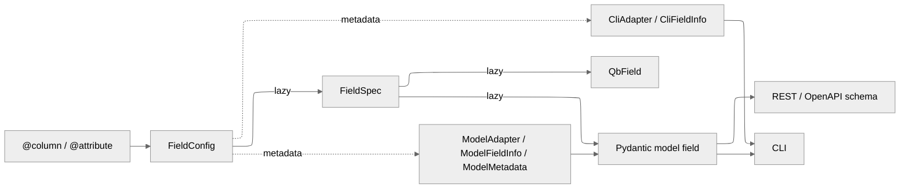

# AEP 010: Declarative ORM Fields and Generated Models

| AEP number | 010                                                             |
| ---------- | --------------------------------------------------------------- |
| Title      | Declarative ORM Fields and Generated Models                     |
| Authors    | [Edan Bainglass](mailto:edan.bainglass@psi.ch) (edan-bainglass) |
| Champions  | [Edan Bainglass](mailto:edan.bainglass@psi.ch) (edan-bainglass) |
| Type       | S - Standard                                                    |
| Created    | 15-September-2026                                               |
| Status     | draft                                                           |

## Background and problem description

This AEP proposes a redesign of the AiiDA ORM field and model APIs around declarative field definitions and lazily generated Pydantic models.

The current ORM exposes related concepts through several partially independent mechanisms: Python properties, QueryBuilder fields, constructor arguments, serialization models, CLI metadata, REST schemas, and backend field mappings. These representations can drift apart and often require duplicated declarations.

The proposed design makes the ORM field declaration the canonical description of entity state. From this declaration, AiiDA derives:

- runtime ORM access;
- QueryBuilder fields;
- read, create, and update Pydantic models;
- CLI metadata;
- REST/OpenAPI schemas;
- field mutability and lifecycle information.

For nodes, persisted attributes are declared separately from top-level database columns while retaining the same common field semantics.

Models are generated lazily on first access through an entity-specific namespace:

```python
Node.models.read
Node.models.create
Node.models.update
```

Node classes additionally expose generated models for their attributes namespace.

The redesign also simplifies construction. `Node` subclasses no longer use specialized `__init__` implementations for ordinary persisted state. Specialized construction from external representations is expressed through named class methods such as `from_ase`, `from_path`, or `from_object`.

The proposal intentionally does not attempt to solve all ORM design questions at once. In particular, constructor-default inference, immutable collection interfaces, broader database restructuring, and some static-typing limitations are deferred.

---

## Motivation

AiiDA ORM entities currently expose the same underlying data through multiple interfaces that have evolved independently.

A field may simultaneously have:

- an ORM property;
- a backend/database key;
- a QueryBuilder representation;
- constructor behavior;
- a Pydantic schema field;
- serialization logic;
- CLI metadata;
- REST metadata;
- custom conversion logic.

This leads to duplicated information and makes changes difficult to propagate consistently.

For example, changing the type or mutability of a field may require updating its property annotation, QueryBuilder declaration, constructor model, REST model, and CLI metadata independently.

The redesign has three primary goals:

1. **Establish a canonical field declaration.**

   The ORM class should describe the fields of an entity once, with other representations generated from that description.

2. **Separate representations from lifecycle operations.**

   Reading an existing entity, creating a new entity, and updating an existing entity have different schemas and mutability constraints. These should be represented explicitly.

3. **Make ORM schemas reusable across interfaces.**

   Python, CLI, REST, and serialization interfaces should derive their schemas from the same field metadata wherever possible.

A secondary goal is to simplify the ORM API itself. In particular, constructors should not have to duplicate field definitions and validation already represented by the ORM schema.

---

## Design Principles

### Overview

The core aim of the redesign is to integrate all ORM field metadata and logic into a single, coherent declarative system that can drive multiple representations and interfaces consistently. The architecture is illustrated in the following diagram:



### Field declarations describe persisted state

A declarative field corresponds to an actual persisted value.

For example:

```python
@attribute
def filename(self) -> str | None:
    ...
```

describes a persisted node attribute.

In contrast, aggregate or convenience views remain ordinary properties.

For example, `Dict.value` represents the complete flattened attributes mapping but does not correspond to a persisted `attributes.value` key. It therefore remains a regular property rather than an `@attribute`.

This distinction is important for preserving the correspondence between ORM declarations and QueryBuilder paths.

### Representation changes are explicit

If the value exposed by the ORM differs from the value represented by a model, the conversion is expressed through a `ModelAdapter`.

For example:

| ORM representation | Model representation |
| ------------------ | -------------------- |
| `pathlib.PurePath` | `str`                |
| `Computer`         | integer primary key  |
| `Enum`             | `str`                |
| `Kind`             | `dict`               |

Pydantic validators should not be used to hide an actual ORM/model representation boundary.

### Lifecycle differences are represented by separate models

Read, create, and update operations have different semantics.

The proposed model flavors are therefore:

```python
Entity.models.read
Entity.models.create
Entity.models.update
```

rather than a single model with many context-dependent behaviors.

### Generated infrastructure should be lazy

Model generation can be relatively expensive and is not required for many common ORM operations.

Generated models and specialized QueryBuilder fields should therefore be constructed on first use and cached per concrete entity class.

This also minimizes class-definition-time overhead, which is particularly important for daemon and plugin-loading performance.

### Specialized construction represents external input forms

Named constructors are appropriate when the input is not itself the persisted ORM representation.

Examples include:

```python
StructureData.from_ase(...)
SinglefileData.from_path(...)
EnumData.from_member(...)
JsonableData.from_object(...)
EntryPointData.from_entry_point(...)
```

Named constructors should not merely flatten ordinary persisted fields into an alternative constructor signature.

---

## Field Architecture

The field hierarchy is:

```text
BaseField
├── Column
│   └── NodeAttributesColumn
└── NodeAttribute
```

A `Column` represents top-level entity state backed by the database entity.

A `NodeAttribute` represents a named entry in the node attributes mapping.

`NodeAttributesColumn` represents the attributes mapping itself and provides the bridge between the two.

### Common field specification

Fields share common metadata through a base specification:

```python
@dataclasses.dataclass(frozen=True)
class BaseFieldSpec:
    name: str
    value_type: t.Any
    description: str
    readonly: bool
    required_once_stored: bool
```

The declaration configuration may additionally contain representation-specific metadata:

```python
@dataclasses.dataclass(frozen=True)
class BaseFieldConfig:
    readonly: bool = False
    required_once_stored: bool = False

    model_field_info: ModelFieldInfo = dataclasses.field(default_factory=ModelFieldInfo)
    model_adapter: ModelAdapter[t.Any, t.Any, t.Any] | None = None
    model_metadata: tuple[ModelMetadata, ...] = ()

    cli_exclusive: bool = False
    cli_field_info: CliFieldInfo = dataclasses.field(default_factory=CliFieldInfo)
    cli_adapter: CliAdapter[t.Any, t.Any] | None = None
```

The distinction between configuration and specification is intentional.

The configuration describes what was requested by the field declaration. The resolved specification describes the actual field after information such as the getter return type and backend mapping have been resolved.

Validation is performed against the resolved specification.

---

## Columns

Top-level entity fields are declared with `@column`.

A column specification additionally contains database-related semantics:

```python
@dataclasses.dataclass(frozen=True)
class ColumnSpec(BaseFieldSpec):
    backend_key: str
    updatable: bool
    may_be_large: bool = False

    @property
    def immutable(self) -> bool:
        return not self.updatable
```

This replaces the previous `FieldAccess` abstraction.

The previous states map naturally onto the new representation:

| `readonly` | `updatable` | Semantics               |
| ---------- | ----------- | ----------------------- |
| `True`     | `False`     | read-only               |
| `False`    | `False`     | create-only / immutable |
| `False`    | `True`      | mutable                 |

The distinction between `readonly` and `updatable` is important.

A field can be writable during creation but immutable afterwards. Such a field is not read-only, but it is not updatable either.

---

## Node Attributes

Node subclasses declare persisted attributes using `@attribute`.

For example:

```python
@attribute
def value(self) -> int:
    """The integer value."""
    return self.base.attributes.get('value')

@value.setter
def value(self, value: int) -> None:
    self.base.attributes.set('value', value)
```

Attribute declarations are inherited and may be overridden by subclasses.

This allows primitive data types to narrow their attribute types naturally:

```text
PrimitiveType
└── NumericType
    └── Int
```

Each concrete type defines the type of its own `value` attribute instead of inheriting a generic untyped implementation.

### QueryBuilder access

Declared attributes are reflected in QueryBuilder fields:

```python
Int.attributes.value
```

The resulting child field is type-aware.

Node classes that accept arbitrary attributes require different behavior. `Dict`, for example, preserves its historical flattened representation:

```python
{
    'key_a': value_a,
    'key_b': value_b,
}
```

rather than storing the dictionary under an `attributes.value` key.

Its attributes model therefore permits extra fields.

For an open attribute namespace:

```python
Dict.attributes.some_key
Dict.attributes['some_key']
```

produce generic `QbAnyField` instances.

For a closed attribute namespace, undeclared keys are rejected:

```python
Int.attributes.value       # valid
Int.attributes['value']    # valid

Int.attributes.other       # invalid
Int.attributes['other']    # invalid
```

`QbAttributesField` itself remains independent of Pydantic. Whether extra keys are permitted is determined when `NodeAttributesColumn` specializes the field for a concrete node class.

---

## Field Typing

The return annotation of the field getter defines the canonical ORM value type unless explicitly overridden for a model representation.

A missing annotation is an error.

An explicit `Any` annotation is also rejected.

For example:

```python
@attribute
def value(self) -> t.Any:
    ...
```

is invalid.

`Any` disables meaningful type checking and causes overload resolution to accept essentially every operation. If a field genuinely accepts arbitrary values, it should instead use:

```python
@attribute
def value(self) -> object:
    ...
```

`object` expresses an unconstrained value while preserving static type-checking behavior.

Such a field maps to `QbAnyField`.

---

## QueryBuilder Fields

The field declaration is also responsible for constructing its QueryBuilder representation.

The base field manages:

- the `QbField` cache;
- Qb field type selection;
- construction from the field specification;
- invalidation when the field declaration changes.

Columns and attributes differ only in their storage path.

For node attributes, class-level access resolves through the attributes namespace:

```python
Int.attributes.value
```

rather than exposing `value` as an unrelated top-level database field.

Concrete classes may retain convenience aliases such as:

```python
Int.value
```

for discoverability and autocompletion, but the canonical query path remains:

```python
Int.attributes.value
```

---

## Generated Models

The ORM exposes generated Pydantic models through a namespace on the entity class:

```python
Entity.models.read
Entity.models.create
Entity.models.update
```

Access through an instance is prohibited.

For example:

```python
Node.models.read
```

is valid, whereas:

```python
node.models
```

raises an informative `AttributeError`.

The namespace is cached separately for each concrete entity type.

Models are generated lazily.

### `OrmModel`

Generated models share a common base:

```python
class OrmModel(pydantic.BaseModel, Generic[_EntityT]):
    ...
```

The generic parameter associates a generated model with the corresponding ORM type.

### Read model

The read model describes the representation of an existing ORM entity.

Conceptually:

```python
model = Node.models.read.from_orm(node)
```

The read model contains all readable fields, including read-only and backend-generated values.

### Create model

The create model describes valid input for creating an entity:

```python
node = Node.models.create(...).to_entity()
```

The model includes fields that may be specified during creation.

Read-only fields are omitted.

This replaces the previous `WriteModel` terminology with the more precise `CreateModel`.

### Update model

The update model contains only fields that may be changed after creation.

Applying it modifies only explicitly supplied fields:

```python
model.apply(entity)
```

This is important for PATCH-like behavior.

A field omitted from an update model is distinct from a field explicitly set to `None`.

---

## Model Field Generation

The model annotation for a field is derived in the following order:

1. explicit annotation from `ModelFieldInfo`;
2. model type declared by `ModelAdapter`;
3. ORM field type.

Conceptually:

```python
field_info = field.model_field_info

if field_info is not None and field_info.annotation is not None:
    annotation = field_info.annotation
elif field.model_adapter is not None:
    annotation = field.model_adapter.model_type
else:
    annotation = field.spec.value_type
```

Nullability is then derived from the ORM field semantics.

---

## Defaults

Nullable model fields default to `None` unless an explicit model default is provided.

The resulting default policy is:

| Annotation                  | Default behavior      |
| --------------------------- | --------------------- | --------------------------- |
| `T`                         | required              |
| `T                          | None`                 | optional, defaults to`None` |
| explicit`FieldInfo` default | explicit default wins |

### Constructor default inference

The implementation explored deriving Pydantic defaults automatically from ORM constructor signatures.

This is not part of the proposal.

Constructor default inference becomes complicated when `default_factory` or other dynamic defaults are involved, and it tightly couples model semantics to Python constructor signatures.

More importantly, there are legitimate reasons for an ORM constructor to expose a broad set of optional values even when the corresponding create model should require them.

Model defaults should therefore remain explicit.

---

## Values Required Only After Storage

Some fields are legitimately absent on a transient entity but guaranteed to exist once it has been stored.

These fields use:

```python
required_once_stored=True
```

Examples include:

- node primary keys;
- file-derived metadata populated during the storage lifecycle;
- `SinglefileData.filename`;
- derived checksums such as selected `md5` fields.

This flag has deliberately narrow semantics.

It should not be used merely because a field is normally filled by a convenience constructor.

For example, metadata that is intrinsic to a valid `PickledData` object should remain a normal required field even if a named constructor is usually responsible for populating it.

The distinction is:

> `required_once_stored` represents state that is genuinely unresolved during the ORM lifecycle and resolved by storage or derived state.

---

## Model Adapters

A `ModelAdapter` defines an actual representation boundary between the ORM and generated models.

Conceptually:

```python
class ModelAdapter(Generic[_OrmValueT, _ModelValueT, _QbFieldT]):
    @classmethod
    def to_model(cls, value: _OrmValueT, *, context=None) -> _ModelValueT:
        ...

    @classmethod
    def to_orm(cls, value: _ModelValueT, *, context=None) -> _OrmValueT:
        ...
```

Examples include:

- ORM entities represented by primary keys;
- `pathlib.PurePath` represented by strings;
- enums represented by their stored values;
- `Kind` and `Site` objects represented by mappings.

Adapters should not become general-purpose domain conversion utilities.

If an entity internally needs the same conversion, the conversion should be implemented as a domain helper and the adapter may delegate to it. The ORM implementation itself should not need to call its model adapter as part of normal domain behavior.

---

## Model Metadata

Pydantic metadata that does not change the basic representation of a field can be attached separately.

Metadata can optionally target specific projections:

```python
@dataclasses.dataclass(frozen=True)
class ModelMetadata:
    metadata: tuple[t.Any, ...]
    projections: frozenset[ModelProjection] | None = None
```

This supports cases such as:

- normalization during creation only;
- validation during create/update while tolerating historical read data;
- read-only serialization behavior.

Representation changes remain the responsibility of `ModelAdapter`.

Whole-model hooks are expressed through ordinary Pydantic model validators and serializers.

---

## Node Attributes Models

Node attributes require nested models in addition to the top-level entity models.

Conceptually:

```python
class AttributesModel(OrmModel[_NodeT]):
    ...

class AttributesReadModel(AttributesModel[_NodeT]):
    ...

class AttributesCreateModel(AttributesModel[_NodeT]):
    ...
```

Update semantics for attributes are handled through the enclosing node update model rather than requiring a third independent attributes projection.

A `NodeModelsNamespace` exposes the appropriate generated attributes models alongside the entity models.

---

## Model Configuration

General model configuration is provided by `OrmModel`.

Entity classes can provide local configuration for generated entity models.

Node classes can additionally provide local attributes-model configuration:

```python
_attributes_model_config = pydantic.ConfigDict(...)
```

For example:

```python
class Data(Node):
    _attributes_model_config = pydantic.ConfigDict(extra='allow')
```

permits arbitrary persisted attributes.

Configuration is deliberately local to the class defining it. It is not inherited implicitly by model generation.

A subclass that wants parent behavior should compose that configuration explicitly.

This avoids hidden schema changes caused by ordinary Python attribute inheritance.

---

## Entity Construction

### Node constructors

Node subclasses no longer redefine `__init__` for ordinary persisted state.

The root constructor is responsible for generic entity state, while generated create models provide structured, validated creation interfaces.

This removes duplication between constructor signatures and schema declarations.

### Named constructors

Specialized construction uses class methods when input is an external representation or workflow.

Examples include:

```python
StructureData.from_ase(...)
SinglefileData.from_path(...)
EnumData.from_member(...)
JsonableData.from_object(...)
EntryPointData.from_entry_point(...)
EntryPointData.from_name(...)
```

In contrast, the following is not sufficient justification for a named constructor:

```python
SomeNode.from_fields(field_a, field_b)
```

if `field_a` and `field_b` are simply persisted ORM fields.

### Initialization hook

The existing `Entity.initialize()` lifecycle hook remains available for transient Python-only state.

For example:

```python
def initialize(self) -> None:
    super().initialize()
    self._cache = None
```

It should not be used to enforce invariants on persisted input that may not yet have been applied.

### Simplified constructors after an attributes/interface split

A later redesign may separate the persisted state of a node from its ORM interface through composition.

Conceptually, a node type could consist of two parts:

```text
Node interface
    +
typed attributes object
```

The attributes object would no longer participate in the `Node` inheritance hierarchy and would therefore be free to expose constructors appropriate to its own data model. For example, a scalar attributes type could naturally support:

```python
IntAttributes(5)
```

while a structured type could support:

```python
SomeDataAttributes(field_a, field_b)
```

without constraining the constructor signature of `Node` or its subclasses.

This could provide a basis for more ergonomic construction in a later phase. A higher-level construction API could compose the attributes object with the node interface, potentially allowing simple user-facing forms while keeping the internal lifecycle based on composition.

The important distinction is that this should not be achieved by progressively specializing `Node.__init__` throughout the inheritance hierarchy. Signatures such as:

```python
SomeData(value)
```

are difficult to reconcile with substitutability when `SomeData` is itself a subclass of `Node`. Moving type-specific construction to a composed attributes object removes that constraint.

The exact user-facing API remains open. Requiring users to explicitly construct both objects, for example:

```python
SomeData(attributes=SomeDataAttributes(...))
```

would expose the composition too directly and is unlikely to be desirable. A future proposal should therefore investigate how this composition can remain an implementation detail while still providing concise constructors for common data types.

This possibility is deliberately deferred from the current proposal. The declarative field architecture and removal of specialized `Node.__init__` implementations establish a cleaner foundation on which such a constructor API could later be designed.

---

## Constructor Validation and Storage Validation

Removing specialized constructors changes when some invariants are checked.

Normal structured creation paths obtain early validation through generated create models and CLI/REST interfaces.

However, direct low-level ORM construction can still create a temporarily incomplete transient object.

The final invariant boundary is `_validate()`, which is called before storage.

For example, a node may temporarily lack fields that are required for a valid stored entity, but `_validate()` prevents such a node from being stored.

This distinction is intentional:

```text
field setter
    immediate validation of an individual assignment

CreateModel
    validation of normal structured construction

_validate()
    final invariant before persistence
```

Whether direct Python construction should provide stronger immediate validation remains an open question.

---

## Serialization and Repositories

Repository dumping is no longer an implicit responsibility of generic node serialization.

Repository content is handled separately through the repository API, for example:

```python
node.base.repository.copy_tree(path)
```

This keeps model serialization focused on entity data and avoids embedding filesystem side effects into schema serialization.

Code classes or other specialized workflows can explicitly combine model serialization with repository export where necessary.

---

## CLI Integration

Fields can provide CLI-specific metadata independently of model metadata.

This includes:

- option aliases;
- ordering/priority;
- representation adapters.

The generic entity class exposes a lazily cached CLI creation specification:

```python
Entity.cli_spec
```

The specification is cached per concrete entity class.

CLI representation can legitimately differ from model representation. For example, a `Computer` may be represented by a primary key in a model and by a label in a CLI interface.

Synthetic CLI inputs that do not correspond to persisted fields should not be represented as fake ORM fields solely to participate in schema generation.

### CLI architecture

CLI schema generation is separated from the core field and model implementation.

The implementation is organized into a small CLI-specific layer:

```text
cli/
├── __init__.py
├── entity.py
├── node.py
└── utils.py
```

Generic entity CLI behavior is defined independently from node-specific behavior. This mirrors the distinction between the generic ORM entity model and the additional semantics required by nodes.

Each ORM entity class identifies the CLI specification type appropriate for that entity through a class-level hook:

```python
_CLS_CLI_SPEC
```

The generic `Entity` implementation uses this class when lazily constructing its CLI specification.

This allows subclasses such as `Node` to specialize CLI behavior without introducing node-specific logic into the generic entity CLI layer.

The CLI specification remains cached per concrete ORM class.

### CLI field configuration

CLI behavior is configured independently from model behavior.

Each field carries CLI-specific configuration alongside its model configuration:

```python
@dataclasses.dataclass(frozen=True)
class BaseFieldConfig:
    ...
    cli_exclude: bool = False
    cli_field_info: CliFieldInfo = CliFieldInfo()
    cli_adapter: CliAdapter[t.Any, t.Any] | None = None
    ...
```

`CliFieldInfo` contains presentation-oriented metadata used when generating command-line parameters, such as aliases, ordering, help text, or other Click-specific configuration.

`CliAdapter` is used when the command-line representation differs from the model representation. For example, an ORM relationship may be represented by a primary key in a generated model but exposed by label in the CLI.

The empty `CliFieldInfo()` instance represents the default CLI behavior. This avoids treating the absence of customization as a separate state and allows CLI generation to inspect the configuration uniformly.

Not every field that is valid during entity creation should necessarily be exposed directly as a CLI parameter. Such fields can be marked with:

```python
cli_exclude=True
```

Excluded fields remain part of the ORM and generated create model but are omitted when preparing `CliCreateSpec.parameters`.

This allows CLI exposure to remain a projection of the declarative ORM schema without requiring the two interfaces to be identical. A field may, for example, be populated indirectly from another CLI option, handled by node-specific preprocessing, or simply be unsuitable as a user-facing command-line parameter.

Synthetic CLI inputs that do not correspond to persisted ORM fields should continue to be defined by the CLI layer itself rather than being introduced as artificial ORM fields solely for schema generation.

---

## Static Typing

The redesign substantially improves the amount of typing information available directly from ORM declarations, but dynamic model generation introduces trade-offs.

### Dynamic generated models

Generated Pydantic classes are created at runtime. Consequently, explicit static model classes are no longer available for type checkers to inspect directly.

This is an immediate loss compared with statically declared model classes.

Runtime schemas remain precise, but tools such as mypy cannot infer all generated model members without additional support.

### Dynamic attribute fields

Similarly, QueryBuilder children attached dynamically to fields such as:

```python
Node.attributes.<name>
```

cannot currently always be inferred statically.

Some of this may be inherent to mypy's handling of dynamically assigned descriptors and generated attributes rather than the conceptual API itself.

### Mypy plugin

A significant portion of the type-specific machinery could eventually move into an AiiDA mypy plugin.

Such a plugin could teach mypy about:

- generated `models` namespaces;
- dynamically declared ORM fields;
- `Node.attributes.<name>`;
- descriptor class-versus-instance behavior;
- model projection types.

This is considered a promising follow-up but is not required for the runtime API proposed here.

---

## Changes to Existing ORM APIs

The redesign results in several user-visible API changes.

### `Data`

`Data` no longer overrides `__init__`.

Specialized input forms are represented by named constructors.

### Models

`ConstructorModel` is removed.

`WriteModel` is renamed to `CreateModel`.

Entity conversion is model-driven:

```python
CreateModel.to_entity()
```

rather than entity-driven through APIs such as `Entity.to_model`.

### Process nodes

A number of getter/setter methods on the `ProcessNode` branch are represented as properties.

Compatibility methods may initially remain, but their eventual removal should be considered separately.

### Primitive data

`BaseType` is renamed to `PrimitiveType`.

Concrete primitive types explicitly define their own `value` attributes instead of depending on a single inherited generic value mechanism.

This improves field typing but requires careful checking of the type annotations of each primitive class.

### `List`

The principal list value is renamed:

```text
List.list -> List.value
```

`List.index` is adjusted to match Python's built-in list semantics more closely:

```python
stop: int | None = None
```

rather than using `0` as the default.

### `Dict`

`Dict.update_dict` becomes:

```python
Dict.update
```

`Dict` continues to use the existing flattened attributes representation.

Its `value` property is an aggregate view of all attributes and is not a declared persisted `@attribute`.

---

## Database Migrations

The redesign attempts to avoid unnecessary database migrations, but some API changes require persisted-key migrations.

### `List`

```text
List.list -> List.value
```

requires migration of the corresponding persisted attribute.

### `OrbitalData`

```text
OrbitalData.orbital_dicts -> OrbitalData.orbitals
```

requires migration of the stored key.

### `Code`

The legacy `Code` class is removed.

Persisted state should use the canonical keys of the new `AbstractCode` hierarchy, for example:

```text
input_plugin -> default_calc_job_plugin
```

where appropriate.

### `Dict`

An earlier design considered changing `Dict` from:

```python
attributes = {
    'foo': ...,
    'bar': ...,
}
```

to:

```python
attributes = {
    'value': {
        'foo': ...,
        'bar': ...,
    }
}
```

This would make `Dict` structurally resemble scalar primitive types, but it requires a database migration and introduces significant compatibility concerns.

The proposal therefore retains the existing flattened representation for now.

A future proposal may reconsider this separately.

---

## Classes Deliberately Deferred or Reconsidered

Some existing ORM classes expose deeper conceptual issues that should not be hidden inside this refactor.

### `KpointsData`

`KpointsData` currently represents at least two substantially different concepts:

- explicit k-point arrays;
- mesh and offset specifications.

The latter can be valid without any array data, which conflicts with the semantics of `ArrayData`.

Rather than weakening `ArrayData` solely to accommodate this inheritance, the k-point representation should be revisited separately.

### `BandsData`

`BandsData` depends on the k-point representation and is therefore deferred with it.

### `ProjectionData`

`ProjectionData` combines orbital, array, and reference semantics and is also deferred pending the related redesign.

---

## Alternatives Considered

### Inferring model defaults from constructors

Constructor signatures could be inspected to infer defaults automatically.

This was rejected for the initial design because:

- factories complicate inference;
- constructor semantics need not match model semantics;
- it introduces another source of implicit coupling;
- constructors may intentionally expose broader optional interfaces.

Explicit model defaults are preferred.

### Using validators instead of adapters

Pydantic validators can transform values and could technically be used to convert between ORM and model representations.

This was rejected because it hides an important architectural boundary.

A `ModelAdapter` explicitly states that two representations exist and provides conversion in both directions.

### Storing `Dict` under `value`

This would simplify some conceptual symmetry between `Dict` and primitive data but introduces a database migration and changes query paths.

The existing flattened representation is preserved.

### Eager model generation

Generating models when entity classes are defined provides immediately available classes but imposes startup and plugin-loading overhead even when models are never used.

Lazy generation is preferred.

---

## Open Questions

The following questions remain outside the core proposal or require further discussion.

### Backend API exposure

Should:

```python
Entity.backend_entity
```

be considered public API?

More broadly, should `backend_entity` and `backend` become internal implementation details?

The declarative ORM reduces the need for downstream code to manipulate backend objects directly, which may make a stricter boundary practical.

### `Dict` storage

Should `Dict` eventually migrate to a nested `value` representation?

If so, how should backwards compatibility and historical QueryBuilder paths be handled?

### Static typing

How can static inference for dynamically generated fields such as:

```python
Node.attributes.<name>
```

be improved?

Is a dedicated mypy plugin the appropriate long-term solution?

### Node constructors

Should overriding `Node.__init__` be prohibited completely?

Doing so enforces a strong and predictable lifecycle model, but there may be plugin use cases that genuinely require constructor customization.

The preferred replacement for most existing cases is either:

- declarative persisted fields;
- `initialize()` for transient state;
- named `from_*` constructors for external representations.

### Validation timing

Has moving many entity-level invariants from constructors to `_validate()` made validation too late for direct Python users?

Normal model, CLI, and REST creation paths validate earlier, but bare ORM construction remains permissive until storage.

### `ModelAdapter` complexity

Is `ModelAdapter` sufficiently valuable to justify a dedicated abstraction?

The current proposal argues yes because it provides a clear and reusable representation boundary, but the amount of adapter machinery should be monitored as more ORM classes are migrated.

### `Computer.label` mutability

Should `Computer.label` remain updatable?

The broader mutability semantics of backend entities should be reviewed against the new `updatable` field metadata.

### User name API

`User.get_full_name` can include the email address and therefore does not necessarily return a conventional full name.

Should this API be renamed or split into separate display-name and identity concepts?

### Backend keys

Should field declarations expose `backend_key` at all if backend mappings can be resolved centrally through structures such as `PROJECT_MAP`?

Conversely, should the field declarations become canonical and replace duplicated backend mappings?

Maintaining both mechanisms risks divergence.

### Comment relationships

Should `Comment.node` be represented as a relationship in the backend/database layer rather than as an ordinary foreign-key field?

The declarative ORM makes the semantic distinction between scalar columns and relationships more visible.

### Process attribute mutability

Some process attributes remain updatable after creation.

These should be audited to determine whether this is an intentional lifecycle requirement or historical implementation behavior.

---

## Further Considerations

The following ideas are not part of the initial implementation but may naturally build on it.

### Collection API naming

Consider changing:

```python
Entity.collection.get(...)
```

to:

```python
Entity.collection.one(...)
```

to make the expectation of exactly one result clearer and avoid overloading the common meaning of `get`.

### `SinglefileData.filename` type

Consider using `str` consistently for `SinglefileData.filename` instead of the broader `FilePath` type where the value represents a repository filename rather than a local filesystem path.

### Process and data storage

Consider whether `ProcessNode` and `Data` should remain represented in the same database table.

The declarative field architecture makes their substantially different schemas and lifecycle semantics more apparent.

### Immutable collection views

Stored entities are immutable, but collection-valued properties can still expose mutable Python containers.

One possible design is to return immutable counterparts after storage.

For example:

| Interface type | Unstored representation | Stored representation |
| -------------- | ----------------------- | --------------------- |
| `Mapping`      | `dict`                  | frozen mapping        |
| `Sequence`     | `list`                  | `tuple`               |
| `Set`          | `set`                   | `frozenset`           |

This would require broad interface annotations such as `Mapping` rather than concrete mutable collection types.

An alternative is to retain ordinary collection types but explicitly document that returned collections are copies and mutating them does not mutate the stored entity.

This question should be addressed separately rather than complicating the first iteration of the field redesign.

---

## Consequences

### Benefits

The proposed design provides:

- one canonical source of field metadata;
- shared schemas across ORM, REST, CLI, and serialization;
- explicit create/read/update lifecycle models;
- clearer mutability semantics;
- type-aware QueryBuilder fields;
- explicit representation conversion;
- reduced constructor duplication;
- lazy generation with limited startup overhead;
- a natural route toward richer tooling and schema introspection.

It also makes previously implicit design inconsistencies easier to identify. Several migration questions encountered during implementation — including `Dict`, `KpointsData`, code subclasses, and process attributes — reflect genuine domain-model issues rather than merely implementation details.

### Costs

The largest immediate cost is static typing.

Dynamically generated models cannot provide the same out-of-the-box static model typing as manually declared Pydantic classes.

Dynamic QueryBuilder fields similarly exceed what mypy can currently infer without additional support.

The implementation also introduces metaprogramming and lazy-generation machinery that must remain understandable and predictable.

Finally, shifting specialized constructor behavior toward generated models and `_validate()` changes where users encounter validation failures and should be carefully documented.

---

## Migration Strategy

The migration should proceed incrementally:

1. Introduce the common field, column, and attribute infrastructure.
2. Generate read/create/update models lazily from field declarations.
3. Migrate core entity classes while preserving existing database representations where practical.
4. Introduce only the database migrations required for accepted API/storage renames.
5. Preserve compatibility methods where removal is not necessary for the initial redesign.
6. Defer classes whose current inheritance exposes unresolved domain-model problems.
7. Evaluate typing and performance after migration of the core ORM.
8. Address remaining API cleanups and deeper storage changes in follow-up proposals.

The first implementation should prioritize a coherent architecture without unnecessarily coupling it to all potential ORM cleanup work.

---

## Conclusion

This proposal moves AiiDA toward a declarative ORM in which persisted state is described once and projected into the different interfaces through which users interact with it.

The key architectural shift is that properties, QueryBuilder fields, models, CLI schemas, and REST schemas no longer need to be maintained as parallel definitions.

Instead:

```text
ORM field declaration
        │
        ├── runtime ORM access
        ├── QueryBuilder field
        ├── ReadModel
        ├── CreateModel
        ├── UpdateModel
        ├── CLI schema
        └── REST/OpenAPI schema
```

This does not eliminate every special case in the ORM, nor should it. Repository-backed data, external representations, dynamic attributes, and lifecycle-derived values have genuinely different semantics.

The goal is instead to make those differences explicit while removing the accidental complexity caused by describing the same field repeatedly in unrelated systems.
