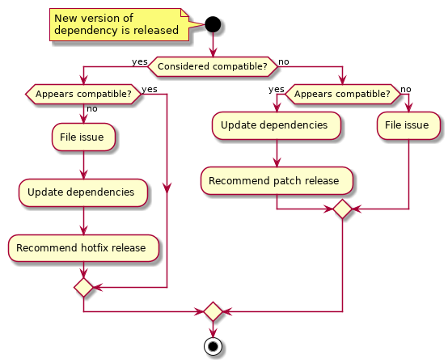

# AiiDA Enhancement Proposal (AEP) Guidelines

| AEP number | 999                                                          |
|------------|--------------------------------------------------------------|
| Title      | AiiDA Enhancement Proposal (AEP) Guidelines                  |
| Title      | AiiDA Dependency Management                                  |
| Authors    | [Carl S. Adorf](mailto:simon.adorf@epfl.ch) (csadorf)        |
| Champions  | [Leopold Talirz](mailto:leopold.talirz@epfl.ch) (ltalirz)    |
| Type       | P - Process                                                  |
| Created    | 18-Nov-2019                                                  |
| Status     | submitted                                                    |

## Scope

This AEP provides guidelines for the management of dependencies and largely applies to all codes within the AiiDA ecosystem, but is specifically targeted at the AiiDA core and plugin packages.

## Background

The AiiDA applications, including the Aiida core package, rely on a multitude of additional libraries and programs that need to be installed within a given environment for a user to for example access an AiiDA database and to manage AiiDA workflows.
These additional codes include service processes such as PostgreSQL or RabbitMQ, and Python packages such as *numpy* or *django*.

The nature of the Python programming language (dynamically typed and interpreted) lends itself to rapid prototyping and fast-paced development, but it also makes it more vulnerable against unintended and undetected API incompatibilities within and between different Python codes.
Ensuring compatibility between Python codes is therefore especially challenging, especially because many Python packages are not only developed fast, but also released frequently.
Therefore, while the procedures proposed in this document are not limited to Python dependencies, special focus and care must be taken with respect to maintaining compatibility between the AiiDA Python codes and their Python dependencies.

The requirements for Python dependencies of the AiiDA-core package are currently manifested within the `setup.json` and `requirements.txt` file within the [repository](https://github.com/aiidateam/aiida-core)'s root directory as well as the [aiida-core-feedstock](https://github.com/conda-forge/aiida-core-feedstock/) recipe file for distribution *via* the conda-forge conda channel.
The vast majority of requirements are currently pinned to an exact version, that means for packages that follow [semantic versioning](https://semver.org/), to a specific patch version.
This ensures that for users who install the package into a clean environment[^1], the installation process is highly reliable and reproducible.
The exact combination of dependencies with pinned versions will likely have been tested as part of the standard AiiDA continuous integration (CI) test pipeline and the risk of installing a package that has introduced intentional or unintentional backwards incompatible changes is significantly reduced.

However, pinning requirements to an exact version also poses a strong constraint on the possible environment dependency solution, meaning that unsolvable conflicts are likely to occur whenever an additional code with its own separate set of dependencies is to be installed into the same environment.
Since AiiDA relies on a plugin package ecosystem to extend the functionality of the AiiDA core package and is supposed to be integrated into existing scientific workflows that string together the functionality of various different codes, such a scenario is common.

In practice, users and developers will often be required to ignore certain dependency version constraints to be able to install a specific combination of Python packages at all, which places them at high risk of incompatibilities which might manifest in breaking workflows or potentially even data corruption.
But even without these dire consequences, the necessity to ignore dependency constraints results in a poor developer and user experience.

It is important to distinguish between the AiiDA core package and plugin packages with respect to how dependencies should be managed.
The AiiDA core package presents a hybrid between an end-user application and a library that supports other applications, which makes dependency management for the core package indubitably more challenging.
For plugin packages that are more likely to be installed and executed in isolation, pinning specific requirements is a reasonable approach to manage dependencies.

[^1]: A clean environment in this context describes a Python environment that has only a minimal set of additional packages installed besides the Python interpreter itself.

## Proposed Enhancement

We propose to introduce the role of a community-appointed *dependency manager* (DM) who is responsible for both monitoring dependencies and addressing intentional or inadvertently introduced incompatibilities.

We further propose that requirements are specified in a dual approach, where likely compatible versions are specified within the core package's `setup.py` file and a concrete set of tested versions is specified in the core package's `requirements.txt` file. This approach will make it easier to install the AiiDA core and plugin packages without compromising the users ability to reconstruct a Python environment with well-defined and tested versions of all dependencies if desired.

Finally, we propose that the DM should handle incompatibilities both proactively and retroactively by following the (pre-)release notes of all dependencies and failures of the test pipeline, and adjusting requirements accordingly.
Incompatibilities must further be reported to the AiiDA core package maintainers and in the case of inadvertently introduced backwards incompatible changes, to the dependency package maintainers.
In either case they must be dealt with by either resolving the incompatibility or by dropping/replacing the dependency while the compatible range is (temporarily) restricted as necessary.

## Detailed Explanation

### Dependency Manager Role

The processes laid out in the following section should be handled by a community-appointed *dependency manager* (DM).
The DM's responsibilities with respect to the AiiDA core package include:

  1. Ensuring that dependencies are declared in the manner laid out in the following section.
  2. Following the release notes of all dependencies.
  3. Subscribing to alerts by the test pipeline related to incompatibilities.
  4. Addressing issues rooted in incompatibilities that are introduced on purpose or inadvertently by new releases of dependency codes in the way outlined below.
  5. Maintaining a watch-list for problematic dependencies, *e.g.*, codes that regularly cause incompatibilities or are otherwise poorly maintained, and providing general recommendations concerning the addition or removal of dependencies.

Furthermore, the DM assists plugin package developers by making recommendations concerning the declaration of dependencies for plugin packages.

The DM's responsibilities do **not** include:

  1. Resolving incompatibilities through providing code contributions, albeit they are of course free to do so.
  2. Monitoring dependencies and addressing incompatibilities of plugin packages.

The DM can delegate specific tasks at any time.

### Python Dependency Specification

To alleviate the issues that come with pinning requirements without sacrificing the benefits of providing a concrete environment for the AiiDA core package, we propose a dual approach for dependency specification:

  1. The package dependencies are specified with the maximal deemed compatible range with liberal use of the [compatible release](https://www.python.org/dev/peps/pep-0440/#compatible-release) operator: `~=`. The dependencies are specified within the `setup.py` file (or equivalent) within the repository root directory; from here on referred to as *requirements*.
  2. A specifically tested environment with all pinned requirements is documented within the `requirements.txt` file (or equivalent); from here on referred to as *pinned requirements*.

The CI test pipeline for release branches is to be executed for both specifications.
The first one to detect unexpected incompatibilities, the second one to determine the concrete set of tested dependency versions.

This approach allows for more flexibility when installing the package into a given environment with either `pip install` or `python setup.py install`, but also provides users an option to install the package with a known set of tested dependencies, *e.g.*, with `pip install -r requirements.txt`.

The dependencies for plugins should be specified in a similar fashion, however dependencies for plugin packages that are likely to be installed in isolation, *i.e.*, have more end-user application character, are encouraged to pin versions per developer discretion.

### Addressing Incompatibilities

The approach outlined above simplifies the installation of the AiiDA core package, but will also increase the chance for occasional incompatibilities with other codes that do not have a clear policy concerning the introduction of backwards incompatible changes or (inadvertently) break it.

To address (potential) incompatibilities, the DM must follow the (pre-)release notes of every AiiDA core package dependency and subscribe to notifications about test pipeline failures related to incompatibilities.
Whenever a new version of a dependency is released, the DM is expected to react in one of the following ways:

  1. If the new version is **considered compatible, but tests fail** or if there is indication of undetected incompatibilities, the DM must

      * open an issue,
      * update the requirements, and
      * recommend an immediate **hotfix** release.

  Further, the DM should consider placing the affected dependency on the *problematic dependencies* watch list.

  *Example: A package follows semantic versioning, but a new minor or patch release inadvertently introduces backwards incompatible changes.*

  2. If the new version is **considered incompatible, but tests pass** and there is no indication of undetected incompatibilities, the DM should
      * update the requirements and
      * recommend a **patch** release.

  *Example: A new version of numpy is released, tests pass, and there is no reason to suspect that there are undetected incompatibilities.*

  3. If the new version is **considered incompatible and tests fail** or there is indication of undetected incompatibilities, the DM should **open an issue**.

  *Example: A new Python minor version was released and tests fail or the release notes indicate that that there might be problematic backwards incompatible changes.*

This is a visualization of the process outlined above:

In all cases, where the DM must open an issue for the core package related to the incompatibility, core package maintainers must then make a decision to address the incompatibility by either

1. waiting for a resolution upstream,
1. resolving the incompatibility within the AiiDA core package, or
2. dropping or replacing the affected dependency

based on which approach is likely to be most successful with the least amount of effort.
In all cases, the constraint on the dependency version must be left in place until the incompatibility is resolved.

## Pros and Cons

### Pros

 - Introducing an explicit *dependency manager* role makes it easier to define and distribute responsibilities.
 - Relaxing the strict constraints on the dependency versions will simplify the installation of the AiiDA core package in non-clean Python environments and might make it possible in the first place where conflicting version constraints can not be resolved.
 - Relaxing the strict constraints enables users to install later versions of packages and thus take advantage of security and bug fixes as well as newly introduced features, with better confidence that these later versions are actually compatible with the AiiDA core package.
 - Relaxing the strict constraints will make it easier to install the AiiDA core package with `conda` that is stricter than `pip` about the correct resolution of various dependencies within the same environment.
 - Maintaining a watch list of problematic dependencies will enable AiiDA maintainers to be more pro-active about reducing the dependence on problematic code bases.

### Cons

 - Using more relaxed constraints will increase the chance that users install package versions with undetected incompatibilities.
 - Using a dual approach for the dependency specification might increase the overall required effort for dependency management.
 - The requirement for a fast reaction to inadvertent incompatibilities introduced by upstream packages might increase the overall effort for release management.

Especially with respect to the first point, it is important to keep in mind that with strict version constraints, such scenarios are also likely to occur whenever users and developers are forced to ignore strict constraints to be able to install the packages in the first place.
